# 基于支付通道的，去信任实时清算协议 - 从闪电网络谈起

# 摘要
比特币是一种去中心化的电子现金支付系统，在没有可信金融中介的情况下，通过p2p网络实现了安全可靠的价值传输。优点是建立了内在的信任机制，大大降低了对于外部金融监管、风险控制的依赖性。但是同时也产生了三元不可能性问题，既：去中心化、性能、成本三者不可兼得。导致区块链扩容问题长期没有很好的解决方案，虽然比特币已经诞生了十年，区块链技术依然无法在金融领域中大规模应用。

本文分析了比特币扩容困境的根本原因，解释为什么大区块、DAG、分片、侧链跨链、DPoS、PBFT等扩容方案都无法超越三元不可能原理的限制。然后介绍闪电网络的解决方案：**基于支付通道的去信任实时清算协议**。分析它相对于其它扩容方案的独特性与技术优势。

由于比特币的脚本语言是基于堆栈的逆波兰表达式，使得闪电网络的白皮书晦涩难懂。为了便于读者阅读，本文在保证技术原理不变的前提下，使用 Solidity 语言重新介绍闪电网络的技术原理。然后分析它在性能、费用、实时性等方面的技术优势，以及存在的限制。另外还介绍了几种相关的技术进展和改进。最后指出，基于支付通道的去信任实时清算协议能够弥补底层区块链系统的不足，为金融系统提供了去信任的基础设施，而且能够满足现代支付体系的性能需求。

# 1 闪电网络的简介和现状
闪电网络(Lightning Network)最初是由 Joseph Poon 和 Thaddeus Dryja 在2015年的白皮书中提出的。这篇白皮书在比特币社区中产生了很大反响，在众多关于比特币的论文和白皮书中，被认为是第二重要的，其价值仅次于中本聪的创世论文。

由于闪电网络依赖于隔离验证，在2017年比特币隔离验证升级之前，一直停留在概念和内部开发阶段。2018年3月，Lightning Labs 开发并推出了第一个测试版，之后 ACINQ 和 Blockstream 两家公司也相继推出了不同的实现。从此以后闪电网络的发展就步入正轨。根据 [统计网站](**https://1ml.com/statistics**) 的数据，闪电网络目前有 6,761 个节点，30,622 个支付通道，支付通道总计有 729.89 BTC(约281万美金)。说明闪电网络在过去的一年中取得了显著增长。

闪电网络的愿景是解决比特币网络的扩容问题。众所周知，比特币的初衷是实现一个端到端的电子现金系统，为全世界提供一个去信任的、7x24小时服务的电子支付网络。但是比特币的性能却远远达不到要求。按照平均每个交易300字节计算，比特币的平均吞吐量是 5.6 TPS。然而 [Visa](https://www.visa.com/blogarchives/us/2013/10/10/stress-test-prepares-visanet-for-the-most-wonderful-time-of-the-year/index.html) 的峰值吞吐量可以达到 47000 TPS。如果对标这个吞吐量，比特币的区块大小要扩张到 8GB 左右，每年要新增 400 TB的区块数据。这显然是不现实的。

除了闪电网络，比特币社区同时也提出了众多的扩容解决方案，比如大区块、DPoS、DAG、分片等。这些方案试图修改比特币协议本身，例如调整配置参数、优化数据结构、修改共识算法、账本分区处理、优化网络资源管理等等。但是效果都不好，在付出了高昂的代价(增加存储量、增加网络流量、增加逻辑复杂度、弱化去中心化)之后，却只是获得了非常有限的性能提升，和 Visa 相比依然还有几个数量级的差距。

唯有闪电网络脑洞大开、另辟蹊径，使用了新的价值转移范式。在比特币的智能合约基础上，结合链下去信任的清算协议，构建了二层支付系统。彻底摆脱了“去中心化-安全-性能”的三元悖论约束，将系统的吞吐量上限提升到了几十万 TPS 级别，同时可以做到类似于支付宝、微信支付的实时支付体验。而且难能可贵的是，它对比特币网络本身几乎没有带来任何负面影响(隔离验证对于比特币的负面影响很小)。

闪电网络并没有使用类似于零知识证明那样的高难度技术，但是它的巧妙设计依然令白皮书晦涩难读。市面上也缺乏简单易读而且讲解透彻的科普文章，对于广大金融科技与区块链爱好者和投资者来讲，有很高的学习门槛。所以闪电网络技术的价值长期被误解、被低估。本文重新梳理了闪电网络的思想，用通俗易懂的文字，为大家介绍闪电网络的技术原理，总结技术优势和劣势，分析它的适用的场景，最终阐述它在现代电子支付系统中的潜在应用价值。希望能帮助广大读者更深入的认知闪电网络。

此文的章节结构如下：

- 第二节从金融的角度，介绍两种不同的价值转移范式，找出闪电网络的创新思路；
- 第三节详细介绍闪电网络的基本概念和原理
- 第四节结合智能合约的源码介绍技术细节。
- 第五节分析闪电网络技术的优点，解释为什么交易延时可以达到实时支付？为什么吞吐量的理论上限可以达到几十万TPS？应用闪电网络有哪些限定条件?
- 第六节介绍闪电网络还有哪些缺点？在哪些方面可以改进、可以拓展？
- 第七节总结闪电网络技术对于区块链和金融科技的价值和意义。

# 2. 价值转移的范式：所有权交割与债权清算
闪电网络的实现包含智能合约与密码学协议，技术细节比较复杂。为了便于读者理解，我们先从货币银行学的角度重新审视比特币的转账机制是什么？扩容的难点在哪里？然后介绍闪电网络的解决问题思路，从宏观上理解闪电网络的原理，有助于读者理解微观的技术细节。

价值转移有两种不同的范式，一种是所有权的交割，另一种是债权的变更。二者既互相关联，又截然不同的转移方式。

## 2.1 **所有权的交割**
所有权交割是最原始、最朴素的支付方式，人类曾经使用过的黄金、白银、钞票等实物货币都是属于这种情况。我们日常的支付场景中，Alice 把 10 美元的钞票交给 Bob 就完成了支付过程。这种以实物为媒介的价值转移天生可以防止双花问题，因为实物货币具有不可复制性，一旦交割给别人就不可能再花费了。

<center>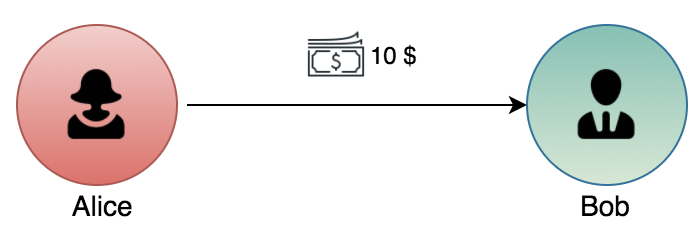</center>

但是对于数字货币来讲，因为数字具有可复制性，而且成本几乎为零，所以双花问题就比较麻烦。虽然数字签名技术可以确定所有者的身份，但是无法确定数字资产是否已经被花费。回到上面的场景，Bob 可以通过数字签名可以验证 10 美元数字货币是 Alice 的，但是无法确认这 10 美元是否已经被 Alice 花费给了其他人。

<center>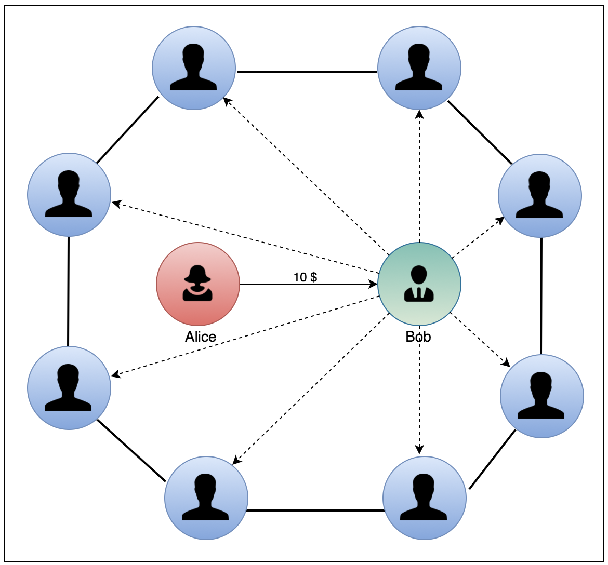</center>

这个问题的困难在于，Alice 可以把数字货币的所有权转给任何人，所以 Bob 需要访问所有可能的接受者，才能确认 Alice 之前没有花费这 10 美元。对于这个问题，中本聪在比特币的创世论文中提到：

**We need a way for the payee to know that the previous owners did not sign any earlier transactions. ... The only way to confirm the absence of a transaction is to be aware of all transactions.**

比特币的解决办法是把账本数据分发给每一个人，让每一个人都拥有所有交易记录副本。为了保证这些账本副本之间的一致性与安全性，每一笔交易都要公开，交给矿工见证、附加上时间戳、按照先后顺序组成链式结构。在见证的过程中附加上工作量证明，令攻击者必须要付出更多工作量才能篡改交易的历史记录。这样 Bob 就拥有了所有交易记录，可以验证 Alice 的确是第一次花费这 10 美元。

比特币创造性的解决了数字货币的双花问题，经过10年的稳定运行，已经证明了其安全性。但是这个解决方案存在天生的运行效率的瓶颈。比特币的平均吞吐量大约是 3~4 TPS，远远无法满足现代支付系统的需求。回顾上面的分析，我们可以发现，问题的根源在于所有权的交割没有明确的范围限制，任何人可以把资产转移给任何人，所以每个人必须要保存所有的交易记录。这其中包含的存储复杂度、通信复杂度、计算复杂度至少都是O(N)的，随着参与者数量 N 的增加，每笔交易的成本也增加。无论系统怎么设计，都无法降低这些复杂度。

## 2.2 **债权的清算**
近代出现了银行、钱庄这样的组织，他们作为金融中介，可以通过债务清算的方式为用户提供支付服务。其工作原理如下图：

<center> 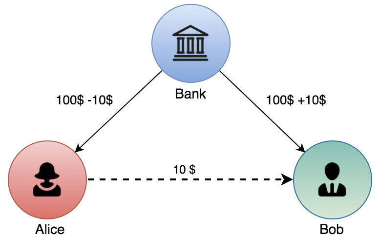</center>

还是假设 Alice 要向 Bob 支付 10 美元，Alice 和 Bob 分别在银行里存入 100 美元。或者说银行分别欠 Alice 和 Bob 100 美元。当 Alice 需要向 Bob 支付 10 美元的时候，银行对 Alice 的债务余额减10美元，对 Bob 的债务余额加10美元。支付过程中 不需要 Alice 和 Bob 之间交割任何实物货币，只需要银行居间调整债务余额就可以了。在金融领域里，债务余额的调整的过程属于清算，债务终结的过程属于结算。这种价值转移方式称之为：银行通过清算间接帮助 Alice 和 Bob 完成了结算。

因为相对于所有权交割的支付方式，债务清算的优势非常明显：

- 促进货币去实物化。

    虽然去实物化的过程从2千年前就开始了。货币从粮食、牲畜，发展到贵金属，再到纸钞，货币越来越轻便，内在价值越来越小。但是依然无法彻底脱离实物载体。到了债务货币阶段才彻底的变成数字。节省了保存、转移等成本。

- 自动化处理。

    数字化的债务货币非常适合计算机处理和网络传输。随着IT技术的发展，债务清算可以全自动化处理，并且可以支持随时随地的远程支付。

- 高效的规避双花问题。

    如果 Bob 要确认 Alice 没有双花，只需要让银行确认当前 Alice 的余额是否是最新的就可以了。不需要访问其它任何人就可以解决双花问题。相对于比特币协议，不需要 Gossip 通信让众多与交易无关的见证者参与共识。把通信、存储、计算复杂度从O(N)降到了 O(1)。大大提升了系统的效率，打破了比特币吞吐量的限制。

通过可信的金融中介大大提高支付的效率、降低支付的摩擦，这种支付方式的创新几十年前就已经开始应用。随着 Visa、支付宝、微信等支付系统的普及，获得了很大的成功。但是这种方式也要付出代价。银行和客户之间的债务关系必须长期续存，这意味着客户的资产长期由银行托管。银行必须有强大的信用背书和风控制度，防范道德风险、管理风险、信用风险，保证银行有充足的偿付能力，以免银行被挤兑。为此现代金融系统建立了一整套法律和监管体系，防范这些风险的累积和爆发。然而随着金融体系越来越庞大、越来越复杂，金融监管的成本也越来越高，这些成本最终转化交易的摩擦有消费者买单。

## 2.3 总结
我们从双花的视角总结一下所有权交割与债权清算。

- 所有权交割是一对多的关系，支付的接收方必须检查所有人的交易记录才能解决双花问题，解决问题的复杂度是O(N)。
- 债权清算是一对一的关系，支付的接收方只需要银行确认对应的债务余额是最新的版本即可，解决问题的复杂度是O(1)。

所以可以得出结论，债权清算在双花问题上具有天然的优势。如果要扩容比特币，与其在比特币协议上修修补补，不如切换价值转移的范式，改成债务清算的模式。


# 3 **去信任的清算协议**

如果从性能和去信任性这两个维度对比银行系统和区块链系统，我们看到二者恰好是互补的。区块链是去信任的，不需要考虑金融中介的信用风险问题，但是它的性能很难扩展；反之，银行系统可以支持高并发、大吞吐量的性能，但是依赖于金融中介的信任，要承担监管和合规的成本，以及市场垄断对创新的伤害。

<center>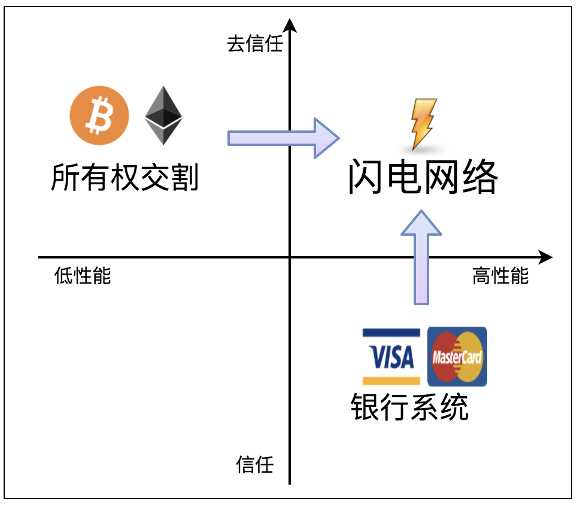</center>

二者像是两个极端，互不相容。能否存在一种解决方案将银行系统和区块链的二者优点整合在一起呢？既能支持海量的支付场景，同时又不依赖于中介的信用？这个看似不可能完成的任务，闪电网络给我们提供了可行的解决方案。它是一种基于智能合约的去信任清算系统。

本章先阐述去信任清算的基本概念，可以帮助读者比较直观的理解闪电网络的思想和理念，有利于消化吸收下一章介绍的技术实现细节。

## 3.1 基本概念

### 3.1.1 **虚拟银行 Virtual Bank**

虚拟银行是运行于区块链上的一个智能合约，由支付双方共同协商创建。它模拟一个银行机构作为支付双方的公共债务人。虚拟银行部署之后，按照预先协商的额度，双方向虚拟银行的智能合约注入资金，完成虚拟银行的筹建。将来如果虚拟银行被清盘结算，资金都返还给支付双方，那么虚拟银行的服务自行终结。

和传统的银行相比，有三个特点：

- **微型**： 一个虚拟银行只有两个账户，只管理特定交易双方的资产。所以资产负债表也只有2条数据。
- **无需信任**：虚拟银行是通过智能合约实现的，继承了智能合约的公开、透明、不可篡改、不可伪造、不可撤销等特点。所以作为公共债务人，虚拟银行没有传统金融机构的风险：比如对手风险、道德风险、流动性风险等。虚拟银行筹建完成之后，它的债务偿付能力永远是100%，自然也不没有金融监管的成本。提供了无需信任的资产托管服务。
- **双重签名**：和一般银行的运营模式不同，虚拟银行不接受客户单方面取款请求。银行只有两个账户，而且总资产不变。一方的资产增加，意味着另一方的资产减少，这是一个零和博弈。为了防止单方面作弊行为，侵害对方的权益，虚拟银行智能合约在处理资产调整请求的时候，要验证双方的签名，保证每一次资产调整都是双方共同的真实意愿。
    
    <center>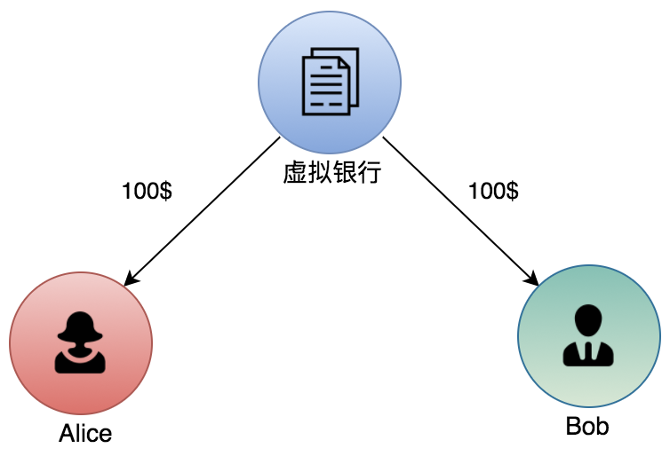</center>

### 3.1.2 **共同承诺 (Mutual Commitment)**
每一次微支付，虚拟银行中的资产负债表要做一次调整。双方在链下对债务调整方案达成一致，形成向虚拟银行智能合约的请求消息，并且双方签名。此消息并不立刻广播到链上，而是由双方存储在本地，称之为**共同承诺**。共同承诺是双方真实意愿的表达，是彼此之间对资产分配方案的承诺。共同承诺一旦达成，在任何时候、任何一方都可以将承诺方案广播到链上，虚拟银行都会兑现承诺，按照预定方案结算银行的资产，分配到双方的账户中。共同承诺的作用类似于银行支票，虽然没有兑现，但是持有共同承诺就可以无风险的、随时的从虚拟银行中兑现响应的资产。

共同承诺的实现必须满足以下几个要求：

- **不可伪造**：共同承诺表达虚拟银行双方当事人的真实意愿，任何第三方无法伪造当事人的身份，生成虚假共同承诺。
- **不可篡改**：对于已经达成的承诺，其中的所有条款无法篡改。虚拟银行智能合约会检查双方的签名，确保承诺的完整性。
- **可以撤销**：共同承诺只要没有提交到虚拟银行兑现，双方可以达成新的承诺，并且撤销旧的承诺。对于交易双方来讲，只有最后的一份共同承诺是有效的，之前达成的历史承诺都应该撤销。可撤销性是通过撤销锁机制实现的。
- **文义证券**：在共同承诺的条款限定条件下，虚拟银行必须能够随时的、无风险的、按照承诺约定的分配方案结算资产。或者说，共同承诺具有文义证券、无因证券的特点。

通俗的来讲，共同承诺就像是双方共同签署的支票，虚拟银行可以在任何时候兑现这张支票。和通常的支票不同的是：它同时处置两个人的资产，而且是虚拟银行中所有的资产都安全兑现。也就是说，一旦兑现某一个承诺，虚拟银行随即关闭。

闪电网络协议中有两种承诺方案：RSMC 承诺与 HTLC 承诺。他们的区别我们后面会讲，但是都满足上述4个条件。

### 3.1.3 **承诺编号 Sequence**
在共同承诺兑现之前，双方可以达成多次共同承诺，撤销旧的承诺，建立新的承诺。这些承诺按照时间顺序编号，以 Sequence 表示。

### 3.1.4 **进攻方(Attacker) & 防御方(Defender)**
如果一方将共同承诺广播到链上，主动向虚拟银行发起申请, 重新结算资产，此方称之为承诺方案的进攻方。被动的接受他人资产分配方案的一方，称之为防御方。

虚拟银行的资产清算，相当于瓜分银行的总资产，是一种零和博弈。假设双方都是理性的决策者，任何一方都不会做出于对方有利，于己方不利的决策。双方需要一种公平的机制管理共同承诺，规避对手风险，防止对方作弊。

在闪电网络的协议里，一个新的承诺方案先由防御方初审。如果防御方接受此承诺方案，就对此签名，然后发送给进攻方进行二审。进攻方持有多个防御方已初审的承诺方案，有权放弃对己方不利的方案。同时有权选择广播共同承诺的时间，当他觉得合适的时候，再加上自己的签名，广播到链上，向虚拟银行请求结算资产。虚拟银行智能合约检验双方的签名，根据共同承诺的条款，公开、透明的结算双方的资产。

### 3.1.5 **对偶承诺方案 Dual Commitment**
和现实中的支票不同，共同承诺都是一式两份，双方各持有一份。两份承诺编号一致、分配方案一致。但是攻守位置互换。比如说 Alice 持有的那一份，Alice 是进攻方，Bob 是防御方(Bob已经初审签名)；反之，Bob 持有的那一份中，Bob 是进攻方，Alice 是防御方(Alice 已经初审签名)。这两份承诺方案是一对，互为对偶承诺方案，具有同等效力。虚拟银行可以接受任何一份，但是只能接受一份。一份承诺被兑现，另外一份立即作废。
    
这样设计的好处有两个：一是保持共同承诺的活性，避免单点故障造成的死锁。因为防御方只能被动等待进攻方向虚拟银行发起请求。假如进攻方故障，不能行使进攻方的职责，防御方可以翻转角色，使用对偶承诺方案，以进攻方的身份完成资产的结算。二是保持灵活性和对称性，任何一方都可以随时主动兑现共同承诺，降低对手风险。

### 3.1.6 **撤销锁 Revocation Lock**
为了标识一个共同承诺方案已经被撤销，闪电网络协议设计了撤销锁机制。在每一份承诺方案中，进攻方必须要放置一个撤销锁。不同的承诺编号、不同的承诺方案镜像有不同的撤销锁。如果一共有 N 对承诺方案，那么需要有 2N 个不同的撤销锁。
    
撤销锁由承诺方案的进攻方管理，它实际是一个随机账户地址，对应的私钥由进攻方保管。如果进攻方要撤销某一个承诺方案，他必须公开对应的撤销锁私钥。反过来说，如果防御方从进攻方拿到了一个撤销锁的私钥，那么他可以相信进攻方确实放弃了对应的承诺方案。 

一般来讲，从虚拟银行开始，一共有 N 对共同承诺方案，前面的 (N - 1) 对承诺方案已经被撤销，这些历史承诺方案的撤销锁私钥是公开的，每一方都会保留一份对方的**撤销锁私钥列表**。只有最后一对承诺方案是有效的，其撤销私钥还没有公开。

撤销锁的安全机制：当一个承诺方案提交给虚拟银行的时候，防御方可以查看此撤销锁的编号(Sequence)。如果防御方发现此承诺方案是已经被撤销的，那么从**撤销锁私钥列表**中，找到对应的私钥，并且生成签名作为凭证，向虚拟银行证明对应的承诺方案是已经被撤销的。虚拟银行将判定进攻方违约，对进攻方处以罚金。这种情况称之为“**破解撤销锁**”。所以如果进攻方是理性的，他就不会冒着撤销锁被破解的风险提交已经撤销的承诺方案。反之，提交未撤销的承诺方案是安全的，因为防御方不知道撤销锁私钥，也就无法破解撤销锁。

当双方创建一对新的承诺方案的时候，需要交换旧承诺方案的失效私钥，表示双方都只承认新的方案，放弃旧的方案。在承诺方案兑现之前，双方都要妥善保存对方的**撤销锁私钥列表**，防止对方使用对己方不利的承诺提案结算虚拟银行中的资产。

### 3.1.7 **诚信保证金 Fidelity Bond**
为了保证承诺方案的公平性，承诺方案会设立**诚信保证金**条款，和撤销锁机制配合使用。当虚拟银行兑现一份承诺方案的时候，防御方被动接受进攻方的资产分配方案，所以防御方的资产份额可以优先结算。而进攻方的所有资产作为**诚信保证金**冻结一段时间。目的是防止进攻方提交一份已经被撤销的承诺方案，侵犯防御方的利益。这个时间段成为**冻结期 Freeze Time**
    
在**诚信保证金**的冻结期间内，虚拟银行会等待防御方破解该方案的撤销锁。如果破解成功，防御方可以取走所有的诚信保证金作为惩罚。进攻方就会损失所有资产。反之，冻结期满之后，进攻方可以取走诚信保证金。

### 3.1.8 **内生的信任机制**
在承诺方案的决策过程中，首先是防御方对承诺方案签名，拥有**初审权**，可以拒绝对防御方不利的条款；然后进攻方对承诺方案签名，拥有**复审权**，可以放弃对于进攻方不利的方案。二者的权利是对等的。

在承诺方案的执行过程中，进攻方拥有**提交权**，有权选择什么时候提交、提交哪一个承诺方案；防御方拥有**监督权**，有权检查承诺方案的有效性，挑战**撤销锁**，惩罚进攻方的违约行为；虚拟银行智能合约拥有**执行权**，公开、公平的按照承诺方案的条款处置双方的资产。三者的权利是不同的，既互相独立、又互相制约。

<center>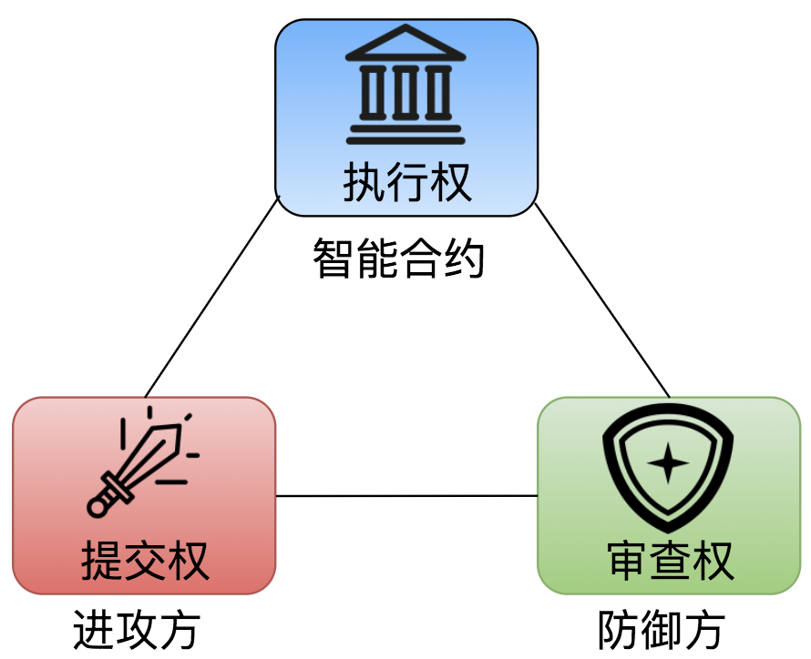</center>

无论是决策阶段、还是执行阶段，基于虚拟银行智能合约的共同承诺协议，构建了一种均衡的二元博弈体系。此博弈的纳什均衡点，形成一种内生的信任机制，不需要外部的第三方监管与信用保障。就像有“一只看不见的手”，自动促使双方必须诚实的遵守共同承诺。

## 3.2 **RSMC承诺方案与支付通道**
在闪电网络中定义了两种承诺方案。第一种称为 RSMC(Recoverable Sequence Maturity Contract)承诺方案，定义了最基本的承诺方案，其中包括承诺编号、撤销锁、诚信保证金、对偶承诺方案等。

假设 Alice 和 Bob 创建了一个虚拟银行，上方初始的资产为 [100, 100]。双方的第一份共同承诺的方案如下图所示。

首先，承诺的 Header 部分有两部分：

- 承诺编号：此例中为 #1。如 3.1.5 所述，每一个编号的承诺都是一式两份，分别为 Alice 和 Bob 持有。这两份承诺互为对偶承诺，攻守位置互换。左面Alice 持有的承诺是以 Alice 为进攻方，Bob 为防御方；反之，右面 Bob 持有的承诺以 Bob 为进攻方，Alice 为防御方。
- 双方的签名：防御方作为初审，已经在承诺里面签名。进攻方的签名暂时还空着。比如说左面 Alice 的承诺中有 Bob 的签名"Bob's Sign"，Alice 还未签名，用"<Alice's Sign>"表示。

在承诺的Body中，一共有三项：

- 资产分配方案：双方约定如何分配虚拟银行的资产，因为这一第一份方案，所以和双方的注资额度是一样的，也是[100, 100]。其中进攻方一方的资产(下划线标识)作为诚信保证金将会被锁定一段时间。
- 进攻方的撤销锁: 由进攻方设定的撤销锁，对应的私钥由进攻方管理。如果此方案撤销，进攻方要公开撤销锁的私钥。
- 锁定期：诚信保证金的锁定时间，此时间要足够长，使得防御方有足够的时间审查进攻方提交的承诺方案。

<center>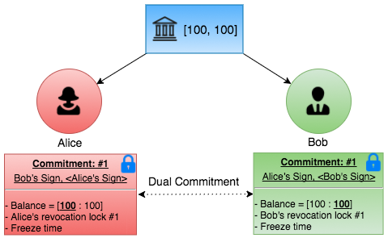</center>

如果 Alice 向 Bob 支付 10 美元，双方会创建一个新的 RSMC 承诺方案，编号为 #2, 而且分配方案改为：[90, 110]。如下图所示。除此之外，双方互相公开编号为 #1 的承诺方案的撤销锁私钥，在新的承诺方案里换了新的撤销锁。

<center>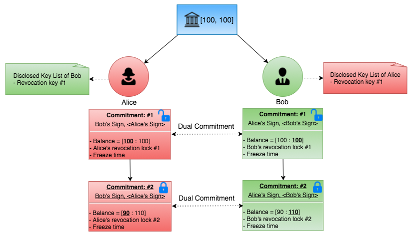</center>

RSMC 承诺方案的特点是没有时间期限，只要没有被撤销，承诺永久有效。任何一方随时可以向虚拟银行提交 RSMC 承诺方案。

**支付通道**
支付双方以虚拟银行托管双方的资产，通过 RSMC 共同承诺重新清算双方的存款余额，已达到价值转移的效果，这种支付工具称之为支付通道。虚拟银行筹建并且达成初始 RSMC 共同承诺，标志着支付通道的开启；虚拟银行根据任何一方提交的承诺方案结算双方的资产，就标志着支付通道关闭。

## 3.3 **HTLC承诺方案与支付通道网络**

### 3.3.1 **HTLC 承诺方案**
RSMC 协议的局限性在于虚拟银行自有两个账户，只能服务于两个人之间的往来支付。支付双方必须建立直连的支付通道，如果在N个人之间建立支付通道，那么每个人需要管理(N-1)个支付通道，总计一共有(N - 1)*N/2 个支付通道。闪电网络进一步提出了 HTLC (Hashed Timelock Contract) 承诺方案，可以将支付通道的负责度从O(N^2) 降低到 O(N)。

和 RSMC 一样，HTLC 中的承诺方案同样也具有不可伪造性、不可篡改性、可撤销性。这两种承诺方案的差异在于：HTLC 承诺方案除了撤销锁之外，还额外添加了时间锁和 Hash 锁条款。具体的来说：

- **时间锁**：承诺只在规定时间内有效。
- **Hash锁**：支付的发送方向接收方出示一个 Hash 值 H，接收方必须公开对应的暗语R，使得 Hash( R ) = H。

接收方当且仅当满足这两个条件，就能获得约定的款项。否则将回退到上一个承诺方案的状态。

举个例子，如下图所示。假设根据当前的共同承诺编号为 #2，余额是 <90美元, 110美元>。Alice 向 Bob 支付10美元。他们约定使用 HTLC 承诺方案，Bob 先生成一个随机数 R，计算其Hash值：H = hash(R)，然后将 H 分享给 Alice，而且约定时间锁 T。那么HTLC 承诺方案的条款应该是这样的：

1. 如果在时间 T 之前，任何一方提交承诺方案，检查暗语 R 是否符合 Hash 锁
    - 如果符合，那么按照<80美元，120美元>的方案结算 Alice 和 Bob 的资产
    - 如果不符合，那么此次承诺方案提交无效。
2. 如果在时间 T 之后，任何一方提交承诺方案，那么按照<90美元, 110美元>的方案结算 Alice 和 Bob 的资产。

HTLC 承诺方案也是分为 Header 和 Body 两部分，其中 Header 部分和 RSMC 是一样的。只是在 Body 部分有差异。其中 Body 分为两部分。第一部分是RSMC 是一样的，表示如果超过了时间锁的期限，那么按照原来的 [90, 110] 方式分配资产。第二部分包含 Hash 锁和时间锁参数，以及新的资产分配方式 [80, 120]，如果满足了 Hash 锁与时间锁的要求，就按照新的方式分配资产。

<center>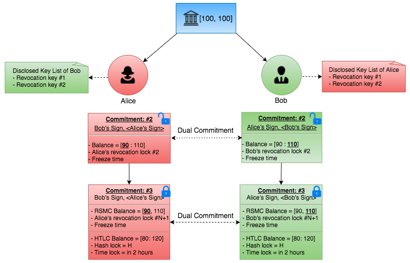</center>

当 #3 号承诺方案达成的时候，双方公开 #2 号承诺方案的撤销锁私钥，表示放弃旧的承诺方案。相对于 RSMC 来说，HTLC 承诺方案是带有限制性条件的临时承诺方案。

### 3.3.2 **支付路径**
HTLC 承诺方案的价值在于可以将首尾相连的多个支付通道串联起来，建立支付路径。如图所示，Alice 和 Carol 没有直接关联的支付通道，但是他们分别与 Bob 建立了支付通道。那么 Alice - Bob - Carol 形成了一条支付路径，他们可以通过支付路径也可以完成支付。假设Alice 向 Carol 支付10美元，基本过程如下：

<center>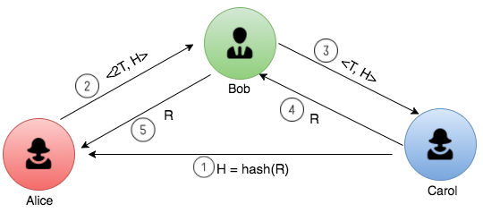</center>

1. Carol 随机产生暗语 R，计算Hash 值： H = hash(R)，并将 H 发送给 Alice。
2. Alice 和 Bob 达成 HTLC 承诺：如果Bob能在时间 **2T** 内出示暗语 R，使得 hash(R) = H, 那么Alice 向 Bob 支付 10 美元。
3. Bob 再和 Carol 达成 HTLC 承诺：如果 Carol 能在更短的时间 **T** 内出示暗语 R，使得 hash(R) = H, 那么Bob 向 Carol 支付 10 美元。
4. 由于 Carol 知道暗语 R 值，在规定的期限T内，可以把R出示给 Bob，获得 Bob 的10美元。之后 Bob 和 Carol 可以再签署一份 RSMC 承诺方案，代替临时的 HTLC 承诺方案。
5. Bob 从 Carol 那里拿到暗语 R 的时候，和 Alice 之间的 HTLC 承诺还没有过期，向 Alice 出示 R 之后，可以获得 10 美元。然后也可以再重新签署一份无期限的 RSMC 承诺，替换临时的 HTLC 承诺方案。

最终的结果就是：Alice 通过 Bob 向 Carol 支付了 10美元，Bob 作为中间人资产并没有变化。HTLC 承诺方案可以在两个联通的支付通道上传递交易，整个过程是可信的。我们从支付通道内和支付通道间两个方面考察对手风险问题。
    
### 3.3.3 支付通道内的对手风险
首先，支付的接收方无法伪造暗语 R 而欺诈对方，在规定的时间内破解 Hash 锁是不可能的。

其次，双方在达成 HTLC 共同承诺之后，可以安全的撤销原来的承诺方案。对于接收方来讲，及时公开暗语 R 值，就可以获得 10 美元，所以放弃原承诺方案没有风险。对于发送方来讲，如果没有及时公开暗语 R，那么就回退到原来的状态；如果及时公开暗语 R，他就可以从前面的一个支付通道获得 10 美元，总之也可以无风险的放弃原有的承诺方案。
        
再次，双方在达成 HTLC 共同承诺之后，发送方不需要担心接收方在获得 10 美元的情况下，不及时把暗语 R 发送给自己。否则接收方必须在规定时间内向虚拟银行提交HTLC 承诺方案，其中包含暗语 R。从智能合约的公开交易数据中，发送方依然可以获得暗语 R。

最后，公开暗语 R 之后，双方可以在时间锁 T 到期之前，按照新的资产负债表建立无时间期限的 RSMC 承诺方案，撤销临时的 HTLC 承诺方案。接收方无疑不会反对替换新承诺方案；对于发送方来讲，拒绝替换方案也没有意义，因为如果发送方想拖延时间，等时间锁过期之后，HTLC 承诺回退，那么接受方为了保护自己的利益，可以及时提交 HTLC 承诺方案，兑现属于自己的10美元。发送方不但无法取回10美元，而且需要重新建立支付通道。
        
### 3.3.4 支付通道间的对手风险 
        
注意到 HTLC 承诺方案是沿着支付路径，从发送方向接收方建立；然后暗语是反方向，从接收方向发送方传递。对于任何一个中间节点，必须向接收端一侧支付 10 美元才能知道暗语 R，否则无法从发送端一侧获得 10 美元的补偿。另一方面，由于发送端的时间锁比接受端的长，当他拿到暗语 R 之后，也有充足的时间，可以无风险的获得 10 美元。
    
对于更长的支付路径，HTLC 承诺方案依然有效。需要注意的是，资金从接收方向发送方传播，每经过一段支付通道，对应的时间锁要增加一个 T，保证资金的发送方有足够的时间向接收到下一个发送方的资金。进一步推广，所有的支付通道链接在一起构成了**支付通道网络**，其中某一些特定的节点作为中心枢纽，链接其它普通节点。一个节点要向另一个节点支付，只要找到一条联通二者的路径，而且路径上的每一段都都有充足的额度，就可以通过这条路径完成价值转移到过程。

# 4. 技术详解：去信任的清算协议
本节具体阐述闪电网络清算协议的技术细节。对于技术细节不感兴趣的读者可以略过此部分，只需阅读第3节。

闪电网络的技术细节晦涩难懂，而且工程实现的复杂度也比较大。部分原因是由于闪电网络的清算协议基于比特币协议，其智能合约是通过堆栈式指令编写，类似于汇编语言的风格。而以太坊的智能合约编程语言 Solidity 的语法接近于 JavaScript，是一种高级编程语言的风格，相对来讲有更好的可读性。所以本文基于 Solidty 重新表达闪电网络协议。在保持技术原理一致性的前提下，尽量提高可读性，帮助读者降低学习的门槛。

根据第3节的讨论，: 虚拟银行智能合约，RSMC 共同承诺方案，HTLC 共同承诺方案。

## 4.1 虚拟银行智能合约

不失一般性，假设 Alice 和 Bob 两个用户在某一段时间内需要频繁的往来支付。于是双方协商建立共同的虚拟银行智能合约。这个合约模拟了一个微型银行，只有 Alice 和 Bob 两个账户。双方约定分别在虚拟银行中存入 100 美元，用 <100, 100> 表示 Alice 和 Bob 在资产负债表的初始余额。

虚拟银行智能合约的源码位于：[GitHub: Solidity Bidirection Payment Channel](https://github.com/dapenghu/solidity-bidirection-payment-channel/blob/master/virtualBank/contracts/VirtualBank.sol)。

### 4.1.1 **合约数据结构**
首先介绍虚拟银行的数据结构，一共分为三部分:

1. 虚拟银行状态 State _state。

    虚拟银行一共有4个状态，如下图所示。

    1. Funding: 智能合约初始化完成之后进入 Funding 状态，Alice 和 Bob 根据约定的额度，调用depoit() 往虚拟银行里转账。Alice 和 Bob 都足额注入100美金之后，虚拟银行进入 Running 状态。
    2. Running: 此时，Alice 和 Bob 在链下可以进行微支付交易。他们随时可以提交资产承诺提案(虚拟银行接受 RSMC、HTLC 两种提案)。虚拟银行将根据承诺提案的条款，立刻结算防御方的资产，冻结进攻方的资产作为诚信保证金。然后进入 Auditing 状态。
    3. Auditing: 在诚信保证金冻结期间，防御方可以检查承诺是否被撤销。如果是，那么他可以取走诚信保证金；否则进攻方可以在冻结期满之后，可以取回诚信保证金。无论哪种情况，虚拟银行都会进入 Closed 状态。
    4. Closed: 虚拟银行的所有资产都已结清，支付通道随之关闭。

    <center>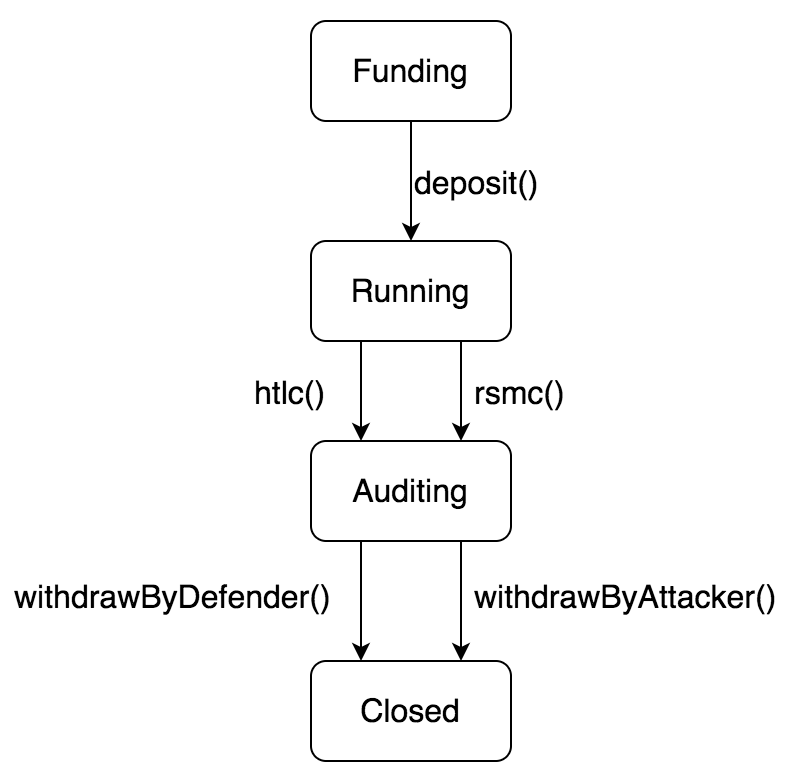</center>

2. 用户数据 Client[2] _clients。

    由于虚拟银行只有两个账户: Alice 和 Bob。所以此数组的长度永远是 2。每一项保存的用户的地址、应存入的余额，以及是否已经足额存款。

3. 承诺数据 Commitment _commitment

    变量 _commitment 记录 Alice 和 Bob 双方已经约定的承诺，包含如何分配虚拟银行的资产，以及承诺编号、进攻方、撤销锁、诚信保证金的冻结时间等。

```
contract VirtualBank {
    struct Client {
        address addr;   // Alice's and Bob's addresses
        uint256 amount;      // amount of each account
        bool    deposited;   // whether each account deposit enough fund
    }

    struct Commitment {
        uint32     sequence;
        uint8      attacker;      // defender = 1 - attacker
        address    revocationLock;
        uint       freezeTime;
        uint       requestTime;
        uint256[2] amounts;        // amount[attacker] is fidelity bond
    }

    // enum for virtual bank state
    enum State { Funding, Running, Auditing, Closed }

    // balance sheets
    Client[2] _clients;

    // state of virtual bank
    State _state;

    // commitment data
    Commitment _commitment;
    
    ... ...
}
```

### 4.1.2 **构造函数**

创建虚拟银行之前，Alice 和 Bob 需要提前协商相关的配置参数，这些参数包括：

1. Alice 和 Bob 的个人账户地址: address[2] addrs。
2. Alice 和 Bob 欲存入的账户余额。

构造函数检查输入参数的合法性，初始化用户数据 _clients, 和承诺方案 _commitment 之后，进入 Funding 状态。

```
    /**
     * @notice The contructor of virtual bank smart contract
     * @param addrs  Addresses of Alice and Bob
     * @param amount Balance amount of Alice and Bob
     */
    constructor(address[2] addrs, uint256[2] amounts) public validAddress(addrs[0])  validAddress(addrs[1]){
        Client alice = Client(addrs[0], amounts[0], false);
        Client bob   = Client(addrs[1], amounts[1], false);
        _clients = [Client(alice), bob];

        _commitment = Commitment(0, 0, address(0), 0, 0, new uint256[](2));
        _state = State.Funding;
        emit VirtualBankFunding(alice.addr, alice.amount, bob.addr, bob.amount);
    }
```
### 4.1.3 **资金存款**
在虚拟银行的 Funding 状态，Alice 和 Bob 调用 deposit() 函数向银行转入预订额度的资金。双方的资金都转入之后，虚拟银行进入 Running 状态。双向支付通道搭建完成，Alice 和 Bob 现在可以使用 RSMC承诺方案 或者 HTLC 承诺方案进行多笔微支付。

```
    /**
     * @notice Alice or Bob deposit fund to virtual bank.
     */
    function deposit()  external payable isFunding() {

        if(msg.sender == _clients[0].addr && msg.value == _clients[0].amount && !_clients[0].deposited) {
            _clients[0].deposited = true;
            emit Deposit("Alice", msg.sender, msg.value);

        } else if (msg.sender == _clients[1].addr && msg.value == _clients[1].amount && !_clients[1].deposited) {
            _clients[1].deposited = true;
            emit Deposit("Bob", msg.sender, msg.value);

        } else {
            throw;
        }

        // If both Alice and Bob have deposited fund, virtual bank begin running.
        if (_clients[0].deposited && _clients[1].deposited) {
            _state = State.Running;
            emit VirtualBankRunning(_clients[0].addr, _clients[0].amount, _clients[1].addr, _clients[1].amount);
        }
    }
```


## 4.2 RSMC 承诺方案

RSMC 承诺方案是最简单、也是最基础的承诺方案。它是 Alice 和 Bob 对于虚拟银行中的资产如何分配达成的相互承诺。虚拟银行的资产清算可以通过 RSMC 承诺方案实现。由于承诺的协商和更新只需要 Alice 和 Bob 双方参与，不需要众多的矿工参与共识，从而实现价值的传递可以快速的完成。

### 4.2.1 RSMC 承诺方案数据结构
根据 3.1 节所述：RSMC 承诺方案具有不可伪造性、不可篡改性、可以撤销性。RSMC 协议模拟了银行资产清算的过程。每一次支付会重新产生一份新的承诺方案，经过一段时间的积累，Alice 和 Bob 会有多份资产清算方案，但是只有最后的方案才是有效的结果。每一个 RSMC 承诺方案都有一个唯一编号。每生成一个新的承诺方案，编号加一。任何时候，编号最大的承诺是有效的，其它的历史承诺方案都已经被撤销。

如下图所示，从虚拟银行建立之后，Alice 和 Bob 一共达成 N 次共同承诺，当前有效的承诺编号为 N，之前编号更低的承诺都已经被撤销。

<center>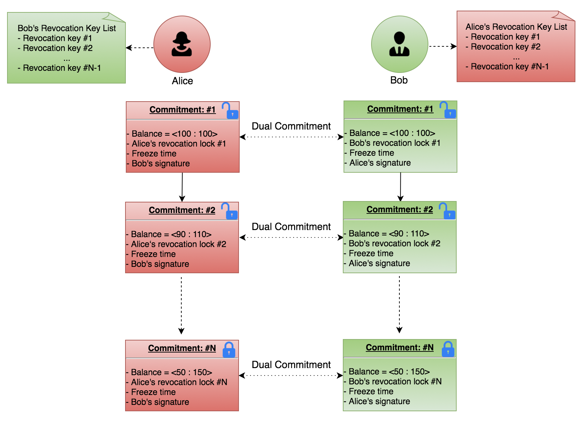</center>

另外注意到，每一次承诺有左右两份，互为对偶承诺，二者的资产负债表和诚信保证金的冻结时间是一样的。但是攻守双方的位置互换。左面的承诺以 Alice 为进攻方，撤销锁是 Alice 生成的，初审的签名由Bob签署；反之，右面的承诺以 Bob 为进攻方，撤销锁是 Bob 生成的，初审签名由 Alice 签署。

这些承诺方案还只有防御方的签名，没有进攻方的签名，处于未兑现状态。如果某一方想兑现承诺，取出虚拟银行中的资产，可以签署自己手里的那一份承诺方案，然后广播到链上。虚拟银行智能合约收到后会按照承诺中约定的方式结算双方的资产。

下面按照支付通道的建立，使用，关闭三个环节介绍 RSMC 承诺方案的使用过程。

### 4.2.2 **创建支付通道**
依然假设 Alice 和 Bob 要创建一个支付通道，要经过4个步骤：

1. 预备阶段：双方交换如下信息
    - 交换彼此的账户地址 
    - 确定各自的出资额度: 比如 Alice 计划出资 100 美元, Bob 也出资 100 美元。
    - 协商诚信保证金的锁定时间(FreezeTime)
    - 提前交换一批撤销锁。比如先交换编号 1-100 的撤销锁。只是交换撤销锁地址，对应的私钥先不要交换。

2. 创建初始的 RSMC 共同承诺：根据已经约定的出资额度<100, 100>, 双方彼此签署第一份 RSMC 承诺方案，编号为 #1. 以上图为例：
    - Alice 以防御方的身份，为右侧 1 号承诺方案签名，然后发给 Bob。
    - Bob 以防御方的身份，为左侧 1 号承诺方案签名，然后发给 Alice。

3. 建立虚拟银行智能合约：Alice 或者 Bob 部署虚拟银行智能合约，其中的配置参数是双方的地址，和出资额度。

4. 分别向虚拟银行注资：虚拟银行智能合约的地址确定后，双方分别向虚拟银行注资。

至此虚拟银行的状态为 Running，Alice 和 Bob 之间建立了双向支付通道。

### 4.2.3 **更新承诺方案**
假如当前的承诺编号是 1，对应的资产分配方案是<100, 100>，如果 Alice 要向 Bob 支付 10 美元，双方的资金需要按照<90, 100> 达成一个新的承诺方案。这个过程分为两步：

1. 生成新的 RSMC 共同承诺：根据已经约定的出资额度<90, 110>, 双方彼此签署第一份 RSMC 承诺方案，编号为 #2. 以上图为例：
    - Alice 以防御方的身份，使用 Bob 的2号撤销锁，为右侧 2 号承诺方案签名，然后发给 Bob。
    - Bob 以防御方的身份，使用 Alice 的2号撤销锁，为左侧 2 号承诺方案签名，然后发给 Alice。
2. 撤销编号为 1 的承诺方案：双方互相公布对应的撤销锁私钥
    - Alice 把左侧 1 号承诺方案撤销锁的私钥发给Bob，表示已经放弃该承诺。
    - Bob 把左侧 1 号承诺方案撤销锁的私钥发给Alice，表示已经放弃该承诺。

如此往复，每一次支付承诺编号加一，而且换一对新的撤销锁。一直到达成第 N 个共同承诺，如下图所示。前面的 N-1 个共同承诺已经撤销，现在双方只能提交编号为 N 的共同承诺方案。因为 Alice 存储着 Bob 的前 N-1 个撤销锁私钥；同时 Bob 存储着 Alice 的前 N-1 个撤销锁私钥。如果任何一方提交了已经被撤销的承诺方案，那么对方就可以破解撤销锁，取走诚信保证金。

<center></center>

### 4.2.4 **承诺方案兑现，关闭支付通道**
达成共同承诺之后，任何一方可以选择在任何时候向虚拟银行提交最新的承诺方案，请求兑现双方的资产。还是接着上面的例子来讲。假设 Alice 要左侧提交编号为 N 的承诺方案，其中资产分配方案为: <50, 150>，此方案里已经有了 Bob 的签名，Alice 需要再加上自己的签名就可以广播的网络上，调用虚拟银行智能合约中的 cashRsmc() 方法，请求最终结算资产。

下面是 cashRsmc() 函数的源码，它接受5个参数，分别是：

1. sequence: 承诺方案的编号
2. balances：Alice 和 Bob 最终的资产分配方案，此例中为：<50, 150>
3. revocationLock: 编号为N，进攻方为 Alice 的撤销锁
4. freezeTime: 诚信保证金的冻结时间
5. defenderSignature：防御方，也就是 Bob 对此承诺方案的签名。证明 Bob 认可此承诺方案的所有配置。

cashRsmc() 首先检查所有输入参数是否有效，包括以下内容：

- 当前虚拟银行出于 Running 状态
- 撤销锁不是黑洞地址
- 资产总额保持一致
- 识别进攻方的身份，并且验证防御方的签名

```
    /**
     * @notice Virtual bank cash a RSMC commitment which is submitted by Alice or Bob.
     * @param sequence          The sequence number of the commitment.
     * @param amounts           The amounts of new balance sheet
     * @param revocationLock    The revocation lock for attacker's findelity bond.
     * @param freezeTime        The freeze time for attacker's findelity bond.
     * @param defenderSignature The defender's signature.
     */
    function cashRsmc(uint32 sequence, uint256[2] amounts, address revocationLock, uint freezeTime, bytes defenderSignature) 
                external isRunning() validAddress(revocationLock) {

        require((amounts[0] + amounts[1]) == (_clients[0].amount + _clients[1].amount), "Total amount doesn't match.");

        // identify attacker's index
        uint8 attacker = findAttacker();
        uint8 defender = 1 - attacker;

        // check defender's signature over sequence, revocation lock, new balance sheet, freeze time
        bytes32 msgHash = keccak256(abi.encodePacked(address(this), sequence, amounts[0], amounts[1], revocationLock, freezeTime));
        require(checkSignature(msgHash, defenderSignature, _clients[defender].addr));
        
        uint requestTime = now;

        emit CommitmentRSMC(sequence, NAMES[attacker], amounts[0], amounts[1], revocationLock, requestTime, freezeTime);

        _doCommitment(sequence, attacker, amounts, revocationLock, requestTime, freezeTime);
    }
```

验证无误之后，调用内部函数 _doCommitment() 执行资产的分配。然后根据**防御方优先结算**的原则，先返还 Bob 的 150 美金资产，把 Alice 的 50 美元资产暂时冻结，从当前开始计算冻结时间，虚拟银行进入 Auditing 状态。

```
    /**
     * @notice Virtual bank settle defender's fund immediately, and freeze the attacker's fund as fidelity bond.
     * @param sequence          The sequence number of the commitment.
     * @param attacker          The attacker's index.
     * @param amounts           Virtual bank settle fund according to this balance sheet
     * @param revocationLock    The revocation lock for attacker's findelity bond.
     * @param requestTime       The time when virtual bank recieves the commitment, ie. the start time of fidelity bond freezing.
     * @param freezeTime        How long attacker's findelity bond will be freezed.
     */
    function _doCommitment(uint32 sequence, uint8 attacker, uint256[2] amounts, address revocationLock, uint requestTime, uint freezeTime) internal {
        _commitment.sequence = sequence;
        _commitment.attacker = attacker;
        _commitment.revocationLock = revocationLock;
        _commitment.requestTime = requestTime;
        _commitment.freezeTime = freezeTime;
        _commitment.amounts[0] = amounts[0];
        _commitment.amounts[1] = amounts[1];

        state = State.Auditing;
        emit VirtualBankAuditing();

        // send fund to defender now
        uint8 defender = 1 - attacker;
        _clients[defender].addr.send(amounts[defender]);

        emit Withdraw(sequence, NAMES[defender], _clients[defender].addr, amounts[defender]);
        emit FreezeFidelityBond(sequence, NAMES[attacker], amounts[attacker], revocationLock, requestTime + freezeTime);
    }

```

**诚信保证金**
前面的一章提到，设立诚信保证金的目的是防止进攻方作弊，提交已经被撤销的承诺方案。比如对于 Alice 来讲，编号为 #2 的承诺方案更有利，她可以获得 120 美元。共同承诺的兑现相当于瓜分银行的总资产，这是一种零和博弈。假设 Alice 和 Bob 都是理性的决策者，无论谁作为进攻方主动分割资产，都不会做出于对方有利，于己方不利的决策。所以在承诺方案的处理过程中，冻结进攻方的资产，同时防御方通过虚拟银行智能合约释放的事件 CommitmentRSMC() 可以得知承诺方案的编号，而且有充分的时间审查此承诺方案释放过期。

正常情况下，Alice 是诚实的，资产编号为最新的，Bob 不会对承诺方案有异议。在冻结期满之后，Alice 可以调用 withdrawByAttacker() 函数赎回被冻结的资产。此函数的源码如下。处理逻辑比较简单，首先检查虚拟银行当前状态是 Auditing, 而且此消息是由进攻方发出的。如果检查冻结时间已满，那么将诚信保证金发给进攻方，同时虚拟银行的状态变成 Closed。

```
    /**
     * @notice After freezing time, attacker withdraws his fidelity bond.
     */
    function withdrawByAttacker() external isAuditing() onlyAttacker(msg.sender) {

        require(now >= _commitment.requestTime + _commitment.freezeTime);

        state = State.Closed;
        emit VirtualBankClosed();

        // send fidelity bond back to attacker
        uint attacker = _commitment.attacker;
        uint256 amount = _commitment.amounts[attacker];
        msg.sender.send(amount);
        emit Withdraw(sequence, NAMES[attacker], msg.sender, amount);
    }
```
但是如果 Alice 不是诚实的，比如说她提交了编号为 #2 的承诺方案。由于 Bob 保存有编号 #1 到 #(N-1) 的所有撤销锁私钥，Bob 可以使用其中的 #2 号私钥签名，调用 withdrawByDefender() 在冻结期未满的时候取出诚信保证金。下面是 withdrawByDefender() 的源码。此函数先确定虚拟银行当前的状态是 Auditing，而且此消息是防御方发出的。然后验证撤销锁的签名是否匹配，验证成功之后将诚信保证金发给防御方。

抢先赎回需要使用豁免私钥签名，此豁免私钥是由 Alice 创建的，不同的支付对应不同的豁免私钥。在每一次支付的时候，Alice 要向 Bob 发送上一次支付对应的豁免私钥。Bob 获得此私钥之后，可以相信 Alice 已经放弃了上次支付对应的资产分配方式。具体的操作过程请参考 RSMC 协议。

```
    /**
     * @notice Defender solve the revocation lock, withdraws attacker's fidelity bond as penalty.
     * @param revocationSignature  Defender's signature to open the revocation lock.
     */
    function withdrawByDefender(bytes revocationSignature) external isAuditing() onlyDefender(msg.sender) {
        uint attacker = _commitment.attacker;
        uint defender = 1 - attacker;

        // check signature for revocation lock
        bytes32 msgHash = keccak256(abi.encodePacked(address(this), _commitment.sequence));
        require(checkSignature(msgHash, revocationSignature, _commitment.revocationLock));
        emit RevocationLockOpen( _commitment.sequence, now, _commitment.revocationLock);

        // Close virtual bank;
        state = State.Closed;
        emit VirtualBankClosed();

        // send fidelity bond to defender
        uint256 amount = _commitment.amounts[attacker];
        msg.sender.send(amount);
        emit Withdraw(sequence, NAMES[defender], msg.sender, amount);
    }
```

无论是 Alice，还是 Bob 取出冻结的资产，虚拟银行都进入关闭状态，对应的支付通道随之也关闭。

## 4.3 HTLC 承诺方案
在 3.3.1 节已经解释过 HTLC 承诺方案的含义，是在 RSCM 的基础上又增加了 Hash 锁与时间锁。下面使用 3.3.2 节的例子，再结合虚拟银行智能合约来解释如何使用 HTLC 承诺方案在支付路径中传递价值。这个过程可以分解为3个阶段：

- **准备阶段**：此阶段要确定支付路径，要链接哪些支付通道，每一段支付通道中的余额是否充足。最终支付的双方要协商 Hash 锁，并且预留足够的时间锁长度。
- **向前传递 HTLC 承诺方案**：此阶段从支付的发送方开始，逐步在每一个支付通道建立 HTLC 承诺方案，一直到接收方为止。这个过程也是传递 Hash 锁的过程。
- **后向传递 Hash 锁暗语**: 从接收方开始，逐个通道公开 Hash 锁的暗语，完成 HTLC 承诺方案的支付条件，并且更换新的 RSMC 承诺方案。

下面按照这三个阶段的顺序，介绍实现的细节。

### 4.3.1 **准备阶段**

如图所示，假设Alice 要向 Carol 支付 10美元，他们打算通过 Bob 作为中间人传递支付。Carol 生成了随机数 R，把对应的 Hash 值 H = hash(R) 发送给 Alice。

<center>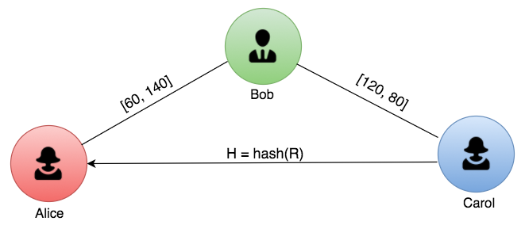</center>

当前 Alice 和 Bob 之间的承诺分配方案的编号是#N，资产分配方式是：[60, 140]。

<center>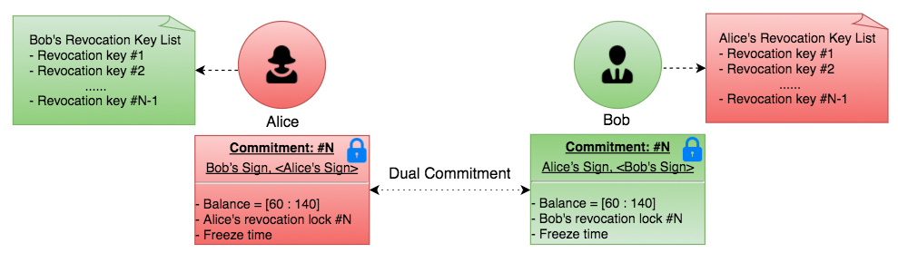</center>

同时，Bob 和 Carol 之间的承诺分配方案编号是#M, 资产分配方式是：[120, 80]。
<center>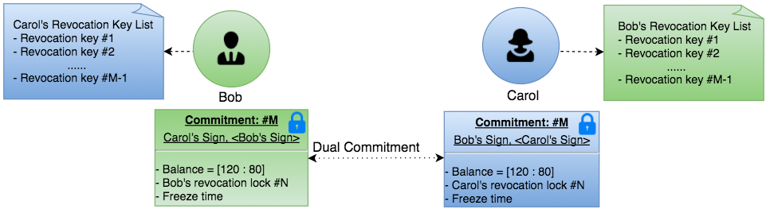</center>

### 4.3.2 **前向传递 HTLC 承诺方案**
首先 Alice 和 Bob 先建立 HTLC 承诺方案，如下图所示。新的 HTLC 方案编号为 N+1。在此承诺中，双方约定，如果 Bob 能在未来**2小时**之内，公开Hash 锁对应的暗语 R，那么就按照 [50, 150] 的方式重新分配资产，等价于 Alice 向 Bob 支付 10 美元。否则还是按照 [60, 140] 的方式分配资产。同时双方都统一撤销编号为 N 的旧承诺。

<center>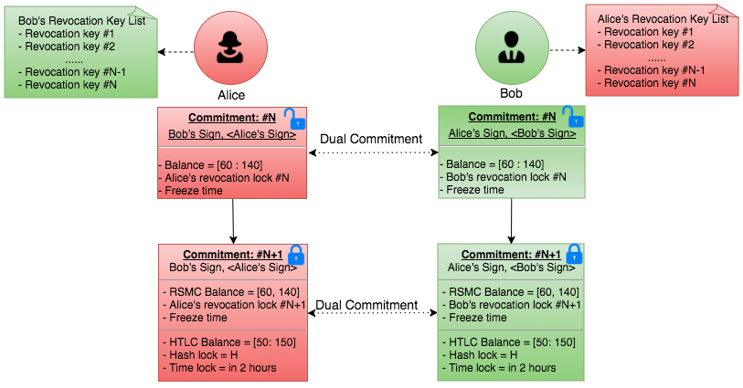</center>

Bob 和 Alice 协商后，拿到 Hash 锁以及锁定的时间，然后转过身 和 Carol 也建立 HTLC 承诺方案，如下图所示。新的 HTLC 方案编号为 M+1。在此承诺中，双方约定，如果 Carol 能在未来**1小时**之内，公开 Hash 锁对应的暗语 R，那么就按照 [110, 90] 的方式重新分配资产，等价于 Bob 向 Carol 支付了 10 美元。否则还是按照 [120, 90] 的方式分配资产。同时双方都统一撤销编号为 M 的旧承诺。

需要注意的是，这里的时间锁为 1小时，前一个时间锁为 2小时。这是为了保证 Bob 从 Carol 那里获得 Hash 锁的暗语 R 之后，有足够长的时间在传递给 Alice。否则一旦逾期，就算拿到 R 也没有意义了。

<center>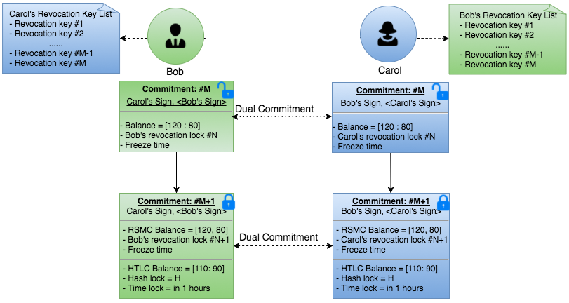</center>

### 4.3.3 **后向传递 Hash 锁暗语**
由于 Carol 知道暗语 R，在约定的 1小时之内把 R 的值公开给 Bob。Carol 有两种方式公开 R。一是私下里把 R 发送给 Bob，第二种是把 HTLC 承诺方案 #M+1 提交给虚拟银行结算，由虚拟银行公布 R 的值。

在第一种情况下，Bob 和 Carol 都认可新的资产分配方案 [120, 80]，他们可以再创建一个长期有效的 RSMC 承诺方案 #M+2，同时撤销临时性的 HTLC 承诺方案 #M+1，如下图所示。

<center>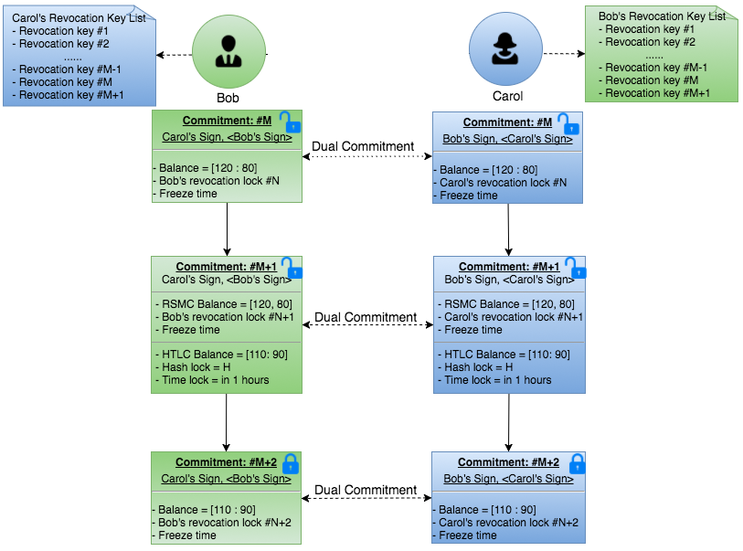</center>

如果是第二种情况，Carol 在HTLC承诺方案 #M+1 中补上自己的签名，然后调用虚拟银行智能合约的 cashHtlc() 方法，请求虚拟银行结算。对应的源代码如下。cashHtlc() 函数会检查时间锁是否预期，如果预期那么按照原来的 [120, 80] 结算资产。如果没有预期，而且Hash锁也匹配，那么按照新的 [110, 90] 结算资产。

```
    /**
     * @notice Virtual bank cash a HTLC commitment which is submitted by Alice or Bob.
     * @param sequence          The sequence number of the commitment.
     * @param rsmcAmounts       Virtual bank settle fund according to this balance sheet if HTLC time lock expire.
     * @param revocationLock    The revocation lock for attacker's findelity bond.
     * @param freezeTime        The freeze time for attacker's findelity bond.
     * @param hashLock          The hash lock in HTLC commitment.
     * @param preimage          The pre-image for the hash lock.
     * @param timeLock          The time lock in HTLC commitment.
     * @param htlcAmounts       Virtual bank settle fund according to this balance sheet if both time lock and hash lock are satisfied.
     * @param defenderSignature The defender's signature.
     */
    function cashHtlc(uint32  sequence,        uint256[2] rsmcAmounts, 
                  address revocationLock,  uint       freezeTime, 
                  bytes32 hashLock;        bytes      preimage;
                  uint    timeLock;        uint[2]    htlcAmounts;
                  bytes   defenderSignature) 
            external isRunning() validAddress(revocationLock){

        // check rsmcAmounts
        require((rsmcAmounts[0] + rsmcAmounts[1]) == (_clients[0].balance + _clients[1].balance), "rsmcAmounts total amount doesn't match.");

        // check htlcAmounts
        require((htlcAmounts[0] + htlcAmounts[1]) == (_clients[0].balance + _clients[1].balance), "htlcAmounts total amount doesn't match.");

        // identify attacker's index
        uint8 attacker = findAttacker();
        uint8 defender = 1- attacker;

        // check defender signature over parameters
        bytes32 msgHash = keccak256(abi.encodePacked(address(this), sequence, rsmcAmounts[0], rsmcAmounts[1], revocationLock, freezeTime, hashLock, timeLock, htlcAmounts[0], htlcAmounts[1]));
        require(checkSignature(msgHash, defenderSignature, _clients[defender].addr));
 
        uint requestTime = now;

        emit CommitmentHTLC(sequence, NAMES[attacker], 
                            rsmcAmounts[0], rsmcAmounts[1], revocationLock, requestTime, freezeTime,
                            hashLock, preimage, timeLock, htlcAmounts[0], htlcAmounts[1]);

        // check time lock
        if (requestTime >= timeLock){
            emit TimeLockExpire(sequence, requestTime, timeLock);

            // if time lock expire, handle this commitment as RSMC
            _doCommitment(sequence, attacker, rsmcAmounts, revocationLock, requestTime, freezeTime);

        } else if {
            // check msgHash lock
            require (keccak256(preimage) == hashLock);
            emit HashLockOpened(address(this), sequence, hashLock, preimage, requestTime);

            // if both time lock and hash lock are satisfied, handle this commitment as HTLC
            _doCommitment(sequence, attacker, htlcAmounts, revocationLock, requestTime, freezeTime);
        }
    }
```

无论是哪一种方式，Bob 都向 Carol 支付了 10 美元，同时获得了暗语 R。而且与Alice 之间的承诺方案至少还有1个小时的时间，有足够的时间公示 R，从 Alice 那里获得 10 美元的补偿。同样，Bob 也有两种方式公开 R。如果选择私下里发送给 Alice，就需要再生成新的RSMC 承诺方案#N+2, 并且撤销 HTLC 承诺方案#N+1，最终的结果如下图所示：

<center>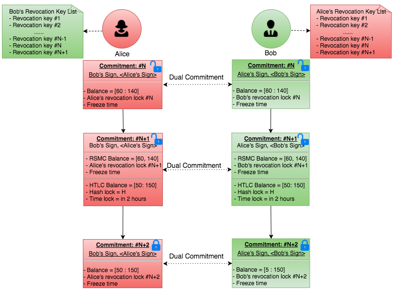</center>

至此，Alice 通过 Bob提供的过度资金向 Carol 支付了 10 美元。整个支付过程完毕。


## 5. 技术优势和劣势分析
根据闪电网络技术的分解，支付通道技术的特点，是把链上的所有权转移转化为链下的共同承诺方案，把参与共识的范围大大缩小了。下面我们逐一分析这种新技术的优势和劣势。

## 5.1 Pros 优点
把交易从链上转到链下来完成，会带来很多优势：

- **交易费用低**

    交易过程中，需要借用中间节点提供的资金流动性，所以需要支付一定的费用。但是由于中间节点是非垄断性的、而且是去信任的，没有监管、合规等成本，费用非常的低。相对于 Visa 2~3% 的费率，闪电网络收取的费用几乎可以忽略不计。

- **交易实时确认**

    支付的过程中无需大量节点参与共识，只需要参与者之间交换共同承诺方案的参数和签名信息，可以实时的完成交易的确认。具体的来讲，交易确认的时间包含：

    - 支付通道路由选择：如果支付双方没有直接联系的支付通道，需要通过路由算法找到合适的支付路径。
    - 支付通道数据交互。每一次承诺方案编号加一，需要2次数据交换：一次是交换新的承诺方案，一次交换旧承诺方案的撤销锁私钥。如果仅仅涉及到 RSMC 承诺方案，每次支付只加一；但是一般情况下是 HTLC 和 RSMC 互相配合使用，承诺方案编号增加2，所以一共需要4次数据交互。

    总的来讲，根据不同的情况、完成一次支付所花费的时间从几百毫秒到几秒钟不等。相对于链上交易，交易一次确认即能保证最终性，不需要多次确认。对于用户来讲，交易的体验与支付宝、微信支付、Visa、MasterCard、PayPal 等传统支付系统几乎是一样的。

    和区块链相比：
    和清算中心相比：清算中心是批处理模式
    
- **高并发性**

    不同的支付路径是互相独立的，可以并行执行，相对于链上的交易，系统的并发性被大幅提升。我们大致的估算一下闪电网络并发性的理论上限。对于正常的一个支付通道来讲，只有建立和关闭发生在链上，一共有4个交易(两个充值、两个取款，闪电网络不需要部署虚拟银行智能合约)。那么底层区块链的吞吐量限制了支付通道的数量，假设平均每个通道的生命周期是 N 天，对应的通道数量的计算公式为：
    
    支付通道数量 <= 比特币TPS x 3600 x 24 x N / 4
    
    根据 [1ML](https://1ml.com/statistics)的统计数据，支付通道的平均寿命为 54.9 天，假设比特币的吞吐量为 3.33 TPS，那么对应的支付通道上限为: 3,952,800。根据6度空间理论，任何两个陌生人之间的间隔不会超过六个人，也就是说，支付路径的最大长度一般不会超过6。那么闪电网络可以同时支持 3,952,800/6 = 658,800 个支付的并发执行。

- **数据存储小**

    交易在链下完成的另一个好处是节约数据存储成本。交易数据只需要在参与方之间传播，历史承诺方案可以立刻丢弃，只需要保存撤销锁私钥列表。相对于链上交易来讲，大大降低了数据存储的需求。

- **隐私性**。

    除了支付通道的开启和关闭，大部分交易都发生在区块链之外，没有广播到链上，只有通道的参与者了解交易的信息。因此所有微支付几乎都无法追踪。对于支付具有天然的隐私性保护。

## 5.2 Cons缺点

另一方面，支付通道的支付方式也有限制条件和缺陷，只有在合适的条件下才能充分发挥它的价值。

- **往来交易**
    
    支付通道的建立是有成本的，开启和关闭支付通道需要至少4笔交易。如果在支付通道的存续期间只有少量的支付，那么支付通道的意义就不大了，不如直接在链上交易。最适合支付通道的应用场景是双方需要频繁的往来交易，比如说银行间支付清算业务。两个银行之间建立支付通道，为其用户之间的往来支付提供清算服务，可以最大的利用支付通道的优势。

- **资金锁定** 

    支付通道的中间节点需要提供一定的资产，这部分资产长期处于锁定状态，牺牲了一部分资金的流动性。
    
- **双方必须在线**

    虽然承诺方案的协商发生在链下，但是虚拟银行的双方都需要监控链上交易，便于及时发现对方提交的承诺方案，才能避免自己的损失。所以支付通道的双方依然需要在线监听链上的交易。这个要求对B端用户没有太大影响，但是对于C端用户来讲，是一个比较强的要求。
 
## 6. 技术的进一步拓展
自从闪电网络的白皮书公开之后，社区对其技术做了很多更加深入的研究，不断的优化去信任的实时清算协议。下面我们介绍三个相关的进展。

### 6.1 Sprites风格的 HTLC 
[Sprites and State Channels: Payment Networks that Go Faster than Lightning](https://arxiv.org/abs/1702.05812) 是2017年发表的一篇论文，它提出了一种新的 HTLC 承诺方案。这种方案被称为 Sprites-风格的 HTLC，对应的，闪电网络协议中 HTLC 被称为闪电-风格的HTLC。这种新的 HTLC 在2个方面对闪电网络协议提出了改进。

- 支持支付通道部分存取款

    在闪电网络协议中，用户一旦从虚拟银行中取款，其中的资产被全部结算，支付通道随即关闭。Sprites-风格 HTLC 支持部分取款。在不关闭虚拟银行的情况下，支付双方向可以向虚拟银行追加资金、或者部分提现。这样提高了支付通道的利用率，也节约了重新开启支付通道的成本。

- 抵押资产优化

    在闪电网络的协议中，HTLC 时间锁的大小和支付路径的长度有关系。假设支付路径的长度为L，如下图所示，按照从接收方到支付方的顺序，时间锁的大小分别为：T，2T ... L*T。在最糟糕的情况下，资产的锁定时间随着支付路径的增加而线性增长。Sprites-风格的HTLC 做了优化，令资产的锁定时间与路径的长度无关。

### 6.2 Perun: 虚拟支付通道
在论文 [Perun: Virtual Payment Hubs over Cryptocurrencies](https://eprint.iacr.org/2017/635.pdf) 中，又提出了一种新的支付通道链接技术，称之为“虚拟支付通道”，进一步改进了 HTLC。

这种技术扩展了虚拟银行智能合约，为支付双方提供了额外的功能。举例来说，假设 Alice 和 Carol 之间没有支付通道，但是他们分别和 Bob 有支付通道连接。在闪电网络的协议中，Bob 作为中间人要分别和 Alice 和 Carol 进行支付。但是在虚拟支付通道的协议中，Bob 并不需要确认双方的交易，甚至于 Bob 临时的离线也没有影响。虚拟通道技术可以进一步降低交易的延时和费用，同时提高了支付系统的可用性。但是要指出的是，论文中只讨论了一个中间节点的情况，如果支付路径包含多个中间节点，依然是一个开放的研究课题。

### 6.3 广义状态通道 Generalized State Channels
支付通道的概念可以推广成为状态通道。在一个状态通道中，Alice 和 Bob 可以完成相对于支付更复杂的链下智能合约功能。比如说，在线游戏、资产交易等。在闪电网络中，Alice 和 Bob 在链下共同管理虚拟银行的债务分配方案。类似的，在状态通道中，双方在链下共同维护一个智能合约的状态，通过一种二元共识协议，对状态更新达成一致，不需要每次都公布到链上。任何一方都随时可以公开链下最新的状态并且同步到链上。

论文 [Counterfactual: Generalized State Channels](https://www.counterfactual.com/statechannels/) 系统的提出了广义状态通道的概念，并且为开发者提供了状态通道的开发框架，Dapp开发者使用其 API 就能方便的集成状态通道的技术。值得注意的是，此论文提出了 **Counterfactual** 的概念，用于概括哪些行为不用上链，可以在状态通道中管理。假设一个链上的真实事件为 X，已经被矿工确认，具有不可篡改、不可伪造、不可撤销性。那么对应的链下事实为 **Counterfactual of X**，它满足3个条件：

1. 事件 X 还没有在链上被确认，也就是说它还没有被广播到链上。
2. 状态通道保证任何参与者都可以单方面广播 X，并且无风险的被矿工确认，成为链上事实。
3. 相关参与者的行为都假设 X 已经在链上发生了，仿佛 X 真的成为不可篡改、不可撤销的事实。

以支付通道为例，一个支付事件 X 可以是 “在虚拟银行中，Alice 的账户减去 10 美元，Bob的账户增加 10 美元”, 那么对应的 **Counterfactual of X** 可以是一个 RSMC 承诺方案：“Alice 和 Bob 共同签署一个承诺方案：Alice 的账户减去 10 美元，Bob 的账户增加 10 美元”。所以闪电网络中的承诺方案可以看成是 **Counterfactual of X** 的一个特例。

这个概念非常有价值，它不但给出了通用的状态通道的基本概念，而且也指出了链上交易的通道化的本质：构建一个可信的机制，使得智能合约的所有参与方，对于将要发生的链上事实提前达成一致，形成 **Counterfactual of X**。此事实虽然未发生，但是等同于发生，并且彼此互相信任对方，任何人都无法反悔。

## 7. 总结，现代支付清算结算系统与应用
在现代金融系统中，有两种并行运作的支付体系：一个是基于所有权交割的现金支付体系，另一个是基于债权清算的银行支付体系。现金支付体系是一种古老的支付模式，具有普适性、门槛低的优势，基本上所有国家和地区都能使用；银行支付体系的优势是：安全、便捷、高效、支持远距离支付；但是需要现代银行系统和金融IT系统的支持，对金融监管、风险控制、网络安全、智能终端等基础设施要求很高，一般只有经济较为发达的国家才能建设。这两种支付体系互相独立、互相关联，互相弥补，共同支撑了金融系统的运行。

以比特币为代表的区块链技术基于互联网技术构建了电子现金支付系统，替代了实物现金，大大降低了现金的存储、携带等管理成本，同时也提高了支付的便捷性、安全性。但是对比于基于债务清算的电子支付系统，由于所有权交割的天然缺陷，交易的成本很高，一直受到扩容问题的困扰，吞吐量低下限制了区块链在金融系统中的普及。

区块链技术经过十年的发展，不断探索、不断创新，以闪电网络为代表的债务清算技术逐步成熟。它使用虚拟银行智能合约代替传统的银行机构托管用户的资产，在链下构建了均衡的博弈规则对资产进行清算。这种新的清算方式一方面保留了无需信任背书和外部金融监管的优势，同时也提升了支付系统的容量和隐私性。**从某种意义上说，比特币通过现代IT技术还原了最原始的价值转移方式，而闪电网络又把我们拉回到了现代。**

这两种区块链技术互相关联，互相弥补，共同为金融提供新的技术解决方案。相对于传统的支付系统，区块链技术有一下优势：

- 低摩擦：区块链有内在的信用机制可以防范支付过程中的对手风险、交易风险，大大节约了对于金融机构的监管、合规成本。这些成本上节约最终会降低支付系统的摩擦，令消费者受益。

- 轻金融：传统金融机构有体量大、成本高、组织结构复杂等特点，没有为社会所有的人群提供有效的服务。而是倾向于为大机构、大企业、富有群体提供金融服务。相对来讲，使用区块链开展金融业务的机构更加灵活、更加轻量级，能有效、全方位地为社会所有阶层和群体提供服务。

- 易普及：区块链基于互联网技术，而且对于可信金融机构的依赖程度低。对于欠发达地区来讲，构建电子支付系统的门槛大大降低了。使金融负能够惠及全球更多人口。

在未来几年，区块链作为基础设施逐渐应用于各种金融服务，逐渐表现出强大的技术创新性，市场和消费者肯定受益颇丰。


