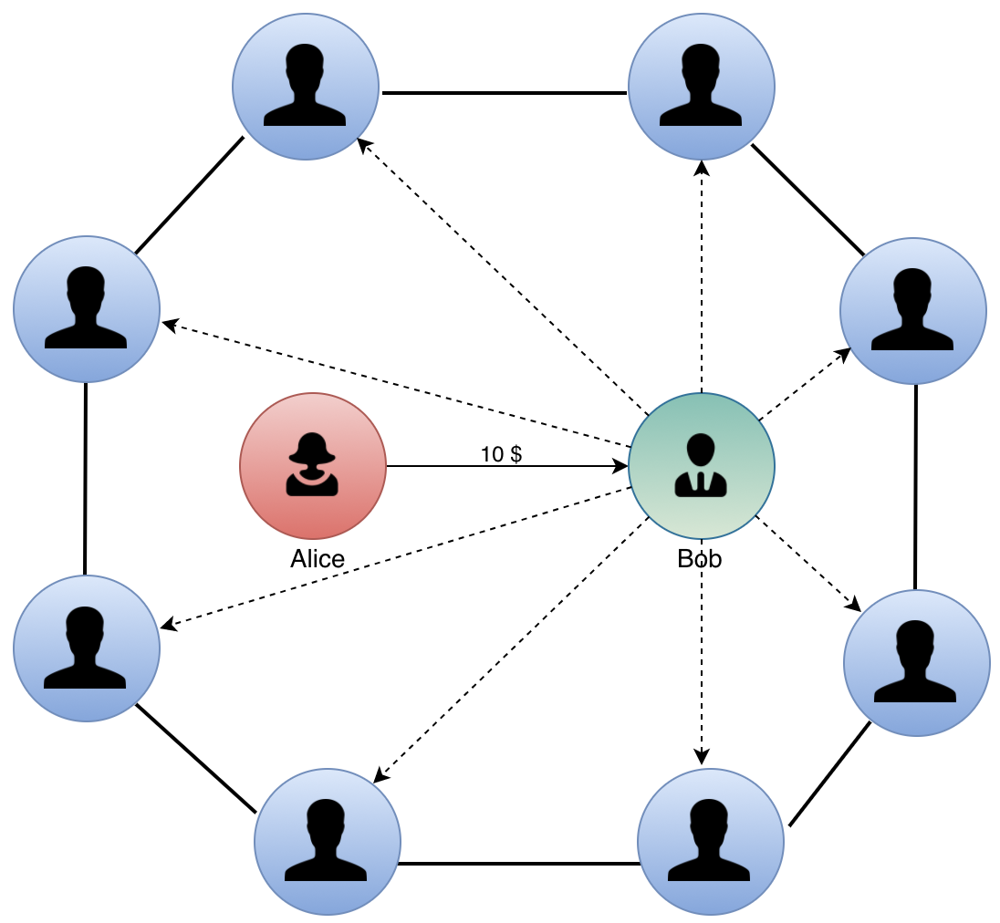

## 去信任的清算协议，以及在现代支付清算结算系统的应用 - 从闪电网络谈起

## 1 闪电网络的简介和现状
闪电网络(Lightning Network)最初是由 Joseph Poon 和 Thaddeus Dryja 在2015年的白皮书中提出的。这篇白皮书在比特币社区中产生了很大反响，在众多关于比特币的论文和白皮书中，被认为是第二重要的，其价值仅次于中本聪的创世论文。

由于闪电网络依赖于隔离验证，在2017年比特币隔离验证升级之前，一直停留在概念和内部开发阶段。2018年3月，Lightning Labs 开发并推出了第一个测试版，之后 ACINQ 和 Blockstream 两家公司也相继推出了不同的实现。从此以后闪电网络的发展就步入正轨。根据 [统计网站](https://1ml.com/statistics) 的数据，闪电网络目前有 6,761 个节点，30,622 个支付通道，支付通道总计有 729.89 BTC(约281万美金)。说明闪电网络在过去的一年中取得了显著增长。

闪电网络的愿景是解决比特币网络的扩容问题。众所周知，比特币的初衷是实现一个端到端的电子现金系统，为全世界提供一个去信任的、7x24小时服务的电子支付网络。但是比特币的性能却远远达不到要求。按照平均每个交易300字节计算，比特币的平均吞吐量是 5.6 TPS。然而 [Visa](https://www.visa.com/blogarchives/us/2013/10/10/stress-test-prepares-visanet-for-the-most-wonderful-time-of-the-year/index.html) 的峰值吞吐量可以达到 47000 TPS。如果对标这个吞吐量，比特币的区块大小要扩张到 8GB 左右，每年要新增 400 TB的区块数据。这显然是不现实的。

除了闪电网络，比特币社区同时也提出了众多的扩容解决方案，比如大区块、DPoS、DAG、分片、侧链、跨链等。这些方案都是试图修改比特币协议本身，例如调整配置参数、优化数据结构、修改共识算法、账本分区处理、优化网络资源管理等等。但是效果都不好，在付出了高昂的代价(增加存储量、增加网络流量、增加逻辑复杂度、弱化去中心化)之后，却只是获得了非常有限的性能提升，和 Visa 相比依然还有几个数量级的差距。

唯有闪电网络脑洞大开、另辟蹊径，使用了新的价值转移范式。在比特币的智能合约基础上，结合链下去信任的清算协议，构建了二层支付系统。彻底摆脱了“去中心化-安全-性能”的三元悖论约束，将系统的吞吐量上限提升到了几十万 TPS 级别，同时可以做到类似于支付宝、微信支付的实时支付体验。而且难能可贵的是，它对比特币网络本身几乎没有带来任何负面影响(隔离验证对于比特币的负面影响很小)。

闪电网络并没有使用类似于零知识证明那样的高难度技术，但是它的巧妙设计依然令白皮书晦涩难读。市面上也缺乏简单易读而且讲解透彻的科普文章，对于广大金融科技与区块链爱好者和投资者来讲，有很高的学习门槛。所以闪电网络技术的价值长期被误解、被低估。本文重新梳理了闪电网络的思想，用通俗易懂的文字，为大家介绍闪电网络的技术原理，总结技术优势和劣势，分析它的适用的场景，最终阐述它在现代电子支付系统中的潜在应用价值。希望能帮助广大读者更深入的认知闪电网络。

此文的章节结构如下：

- 第二节从金融的角度，介绍两种不同的价值转移范式，找出闪电网络的创新思路；
- 第三节详细介绍闪电网络的技术原理：如何使用链上智能合约、配合链下密码学协议实现去信任的债务清算；
- 第四节分析闪电网络技术的优点，解释为什么交易延时可以达到实时支付？为什么吞吐量的理论上限可以达到几十万TPS？应用闪电网络有哪些限定条件?
- 第五节介绍闪电网络还有哪些缺点？在哪些方面可以改进、可以拓展？
- 第六节结合现代电子支付、清算、结算系统，讨论闪电网络技术的应用前景；
- 第七节总结闪电网络技术对于区块链和金融科技的价值和意义。

## 2. 价值转移的范式：所有权交割与债权清算
闪电网络的实现包含智能合约与密码学协议，技术细节比较复杂。为了便于读者理解，我们先从货币银行学的角度重新审视比特币的转账机制是什么？扩容的难点在哪里？闪电网络的解决问题思路是什么？从宏观上理解闪电网络的原理，非常有助于理解微观的技术细节。

价值转移有两种不同的范式，一种是所有权的交割，另一种是债权的变更。二者既互相关联，又截然不同的转移方式。

### 2.1 **所有权的转移**
先谈一下所有权的交割。对资产宣示所有权意味着某一样资产是“我的”，而不是“你们的”。这是个体与集体之间的契约，而不是个体与个体之间的契约。集体中的任何一个人都有可能对所有权发起质疑或者挑战，只有当集体中的所有参与者都认可之后，所有权才能成立。

一对多是一种不对称关系，建立所有权的契约往往不是一件轻松的事。比如在动物世界里，一头狮子对它刚刚捕获的猎物宣示所有权，必须借助于尖牙和利爪，暴力驱赶所有其它的觊觎者。在人类社会也一样，银行间转移大量现金，必须要武装押运，借助于全副武装的军警“说服”其它人认可所有权的归属。一个不太令人愉快的事实就是，暴力是最基本的、最普遍的所有权共识机制。

除了暴力之外，一对多的通信的成本也是很重要的因素。所有权交割的过程中，交易信息必须要广播给其它所有相关者，并且得到集体的见证。很多读者都了解雅浦岛石头币的故事。这些很笨重的石头币就放在公共场合，或者在路边，或是一家房子面前，并不需要人守候。当交易石头币的时候，并不是把这些币搬运到买家的住所。雅浦岛上的居民之间有很好的信用关系，这套货币体系是通过信用建立起来的。但是每一次更新所有权的时候，必须要通知岛上的其它居民，石头币的新主人是谁。否则石头币可能会被二次卖给不知情的人。

<center></center>

这种支付体系的效率是很低的。好在雅浦岛上的居民人数不多，可以交换的商品也不多，交易频次也很低，一个居民一辈子也交易不了几次。石头币可以满足岛民的需求，但是它不适合在大范围内普及。

比特币协议本质上是一种资产所有权的转移系统。每一个节点代表集体中的一个参与者，共同维护一个资产所有权的账本。它的创造性和先进性在于：

第一，用密码学代替了武力保护，大大降低了所有权维护的成本。现代密码学充分利用了数学中的不对称性，防守者只需要付出极小的代价，而攻击者要消耗天文数字的算力才能攻破防守者的防御。

第二，利用互联网的通信和存储能力，极大的扩展了地域限制。世界上的任何一个人，只要能链接互联网，就能使用比特币的支付网络。

第三，利用POW共识算法模拟了参与者对交易的见证过程，令交易过程完全自动化，不需要人工操作。

相对于雅浦岛的石头币，比特币技术大大优化了支付体系的安全性、稳定性、便利性和使用范围。但是并没有改变一对多的所有权关系，而且由于扩大了使用范围，反而大大增加了所有权关系的规模。每一个交易都要广播给更多的参与者，达成共识的的成本增加了。比特币性能瓶颈的本质就在于此。

### 2.2 **债权的清算**
从人类历史的早期，一直到近代货币银行体系建立之前，是以实物货币的所有权交割作为主要的支付手段。曾经使用过的实物货币包括黄金、白银、玉器、纸钞等。近代出现了银行、钱庄这样的组织，他们作为金融中介，可以通过债务清算的方式为用户提供支付服务。其工作原理非常简单，我们用下面两幅图对比两种支付方式的差异。

我们假设 Alice 要向 Bob 支付 10 美元，左图表示现金的支付方式，Alice 通过把 10 美元的钞票转交给 Bob 完成支付。

右图表示债务清算的方式，增加了第三方银行作为公共债务人，Alice 和 Bob 分别在银行里存入 100 美元。或者说银行分别欠 Alice 和 Bob 100 美元。当 Alice 需要向 Bob 支付 10 美元的时候，银行对 Alice 的债务余额减10美元，对 Bob 的债务余额加10美元。支付过程中 不需要 Alice 和 Bob 之间交割任何实物货币，只需要银行居间调整债务余额就可以了。在金融领域里，债务余额的调整的过程属于清算，债务终结的过程属于结算。这种价值转移方式称之为：银行通过清算间接帮助 Alice 和 Bob 完成了结算。

<center>  </center>

相对于事物交割的直接结算，债务清算的间接结算的优势非常明显。

首先，促进货币去实物化。虽然去实物化的过程从2千年前就开始了。货币从粮食、牲畜，发展到贵金属，再到纸钞，货币越来越轻便，内在价值越来越小。但是依然无法彻底脱离实物载体。到了债务货币阶段才彻底的变成数字。节省了保存、转移等不必要的成本。

其次，数字化的债务货币非常适合计算机处理和网络传输。随着IT技术的发展，债务清算可以全自动化处理，并且可以支持随时随地的远程支付。

最后，也是最有启发意义的是，债务关系是1-1的关系，债务余额的更新只需要银行一方执行，三方达成一致。相对于比特币协议，不需要 Gossip 通信让众多与交易无关的见证者参与共识。这一方面节约了通信和存储成本，保护了交易的隐私性，另一方面多笔互不相关的支付可以的并行执行，突破了吞吐量的瓶颈。

<center></center>

通过可信的清算中心大大提高支付的性能，这种支付方式的创新几十年前就已经开始应用，并且获得了很大的成功。它帮助 Visa 每天能够处理几十亿笔交易。但是这种创新也要付出代价。银行和客户之间的债务关系必须长期续存，意味着客户的资产长期由银行托管。银行必须有强大的信用背书和风控制度，防范道德风险、管理风险、信用风险，保证银行有充足的偿付能力，以免银行被挤兑。为此现代金融系统建立了一整套法律和监管体系，防范这些风险的累积和爆发。然而随着银行体系越来越庞大、越来越复杂，金融监管的成本也越来越高，这些成本最终转化交易的摩擦有消费者买单。

### 2.3 **去信任的清算协议**

如果从支付方式和去信任这两个维度对比清算中心和比特币协议，我们看到二者优缺点恰好是互补的。比特币协议是去信任的，不需要考虑金融中介的信用风险问题，但是它的性能很难扩展；反之清算中心可以支持高并发、大吞吐量的性能，但是依赖于金融中介的信任，要承担监管和合规的成本，以及市场垄断对创新的伤害。

<center></center>

能否存在一种解决方案综合清算中心和比特币协议的二者优点呢？既能支持海量的小额支付场景，同时又不依赖于中介的信用？闪电网络给我们提供了可行的去信任清算解决方案。

本小节先阐述去信任清算的大致思路，然后在下一节再介绍技术实现的细节。去信任清算的算法主要分为三部分：

1. 虚拟银行智能合约。交易双方协商一致之后，建立共同的虚拟银行智能合约，分别向虚拟银行存入一定的资产。虚拟银行合约负责托管双方的资产。和一般银行的运营模式不同的是，虚拟银行不接受客户独自取款，只允许用户在共同协商一致的情况下资产清盘。具体来说，任何一个用户都可以作为清盘的发起人，携带双方的签名，向虚拟银行提交新的资产负债表。虚拟银行验证清盘请求后，将资产分别返还交易双方账户。为了防止清盘发起人作弊，侵害对方账户的权益，虚拟银行按照先发起、后结算的原则，优先结算对方账户的资产，临时冻结发起人的资产。在资产冻结期间内，对方账户可以复审清盘方案是否合理。如果发现清算发起人作弊，可以根据提前预定的豁免条款直接取走被冻结的资产，令清盘发起人一无所获；如果没有异议，资产解冻之后，发起人随时可以取走属于自己的资产。所有资产结算完成之后，虚拟银行智能合约自行销毁。
    <center></center>

2. Recoverable Sequence Maturity Contract (RSMC) 可撤销清算协议。虚拟银行智能合约为交易双方搭建了一条双向微支付通道。每一次支付的时候，根据支付额度使用 RSMC 协议调整银行内的资产负债表。每一次资产负债表的调整在链下协商完成，不需要广播给智能合约。直到某一方需要结算的时候，作为发起人请求虚拟银行智能合，使用最终达成的资产负债表协议分配银行资产。

3. Hashed Timelock Contract (HTLC) 支付通道串联协议。虚拟银行智能合约和 RSMC 协议配合，建立了一个简单的支付通道，只能服务于两个人之间的往来支付。但是这些支付通道可以彼此相连，构成一个支付网络。对于任何两个人来讲，只要他们之间存在一条首尾联通的支付通道，而且通道每一段支付通道都可以满足支付额度的要求，就可以通过 HTLC 协议间接的完成微支付。
    <center></center>

总之，在闪电网络的清算协议中，去信任的智能合约代替了传统的银行机构，负责托管用户的资产；基于密码学的 RSMC 和 HTLC 协议，代替了中心化的清算所，负责清算虚拟银行中的资产负债表。这三种技术整合在一起，构建了去信任的、高效的清算系统。

## 3. 技术详解：去信任的清算协议
本节具体阐述闪电网络清算协议的技术细节。对于技术细节不感兴趣的读者可以略过此部分，只需阅读 2.3 节。

闪电网络的技术细节晦涩难懂，而且工程实现的复杂度也比较大。部分原因是由于闪电网络的清算协议基于比特币协议，其智能合约是通过堆栈式指令编写，类似于汇编语言的风格。而以太坊的智能合约编程语言 Solidity 的语法接近于 JavaScript，是一种高级编程语言的风格，相对来讲有更好的可读性。所以本文基于 Solidty 重新表达闪电网络协议。在保持技术原理一致性的前提下，尽量提高可读性，帮助读者降低学习的门槛。

1. 虚拟银行智能合约

    虚拟银行智能合约模拟一个微型银行，用于托管交易双方的备付金。一个虚拟银行智能合约的资产负债表可以表示为：{{Alice address, Alice balance}, {Bob address, Bob balance}}。虚拟银行部署之后，按照预先协商的额度，双方向虚拟银行注入资金，完成虚拟银行的筹建。资金的赎回需要双方共同协商并且签署资产结算协议，任何一方不能单方面转移虚拟银行内的资金。
- 微支付通道
    
    以虚拟银行智能合约中的存款余额为基础，交易双方通过余额清算完成小额支付的过程，称之为微支付通道。虚拟银行筹建完成标志着微支付通道开启，虚拟银行清盘也意味着微支付通道既关闭。
- 清盘提案 (Liquidation Proposal)

    每一次微支付，虚拟银行中的资产负债表要做一次调整。交易双方都可以向虚拟银行提出清盘提案，双方共同签名表示提案达成共识。提案中包含新的资产负债表，要求虚拟银行按照新的余额结算双方的资产。
- 主动提案人 (Offensive Proposer) & 被动提案人(Defensive Proposer)

    主动发起清盘提案请求的一方称为主动提案人；反之，被动接受提案请求的一方称为被动提案人。主动一方负责提交新的资产负债表，被动一方负责审核新的资产负债表是否有效。一次微支付会有两个清盘提案，Alice 和 Bob 分别为主提案人。
- 诚信保证金 Fidelity Bond

    为了保证虚拟银行债务清偿的公平性，主动提案人和被动提案人的清偿顺序不同。假设双方都是理性决策者，不会提交一份于对方有利的资产分配方案。提交新的资产负债表之后，被动提案人的资产优先结算。主动提案人的资产临时冻结、作为**诚信保证金**。在冻结期间，被动提案人有充足的时间审核清算提案是否有效。如果发现分配方案已经过期，在冻结期间可以出示失效凭证取出诚信保证金，惩罚主提案人的不诚实行为。反之，如果被动提案人不能证明提案无效，则无法处置冻结资产。主动提案人在冻结期满后可以取回资产。
- 失效凭证 Invalidation Credential

    失效凭证是一个数字签名，对应的失效私钥由主动提案人生成。主动提案人为每一个清盘提案生成不同的失效私钥。当双方对新的清盘提案达成共识的时候，交换旧清盘提案的失效私钥，表示双方都放弃旧清盘提案。通过失效凭证为清盘提案提供了失效机制。在支付通道关闭之前，被动提案人要保存所有过期清盘提案的失效私钥，防止对方使用对己方不利的过期清盘提案结算虚拟银行中的资产。


根据 2.3 节的讨论，清算协议的技术实现分为三部分:  虚拟银行智能合约，RSMC 可撤销清算协议，HTLC 支付通道串联协议。

### 3.1 虚拟银行智能合约

不失一般性，假设 Alice 和 Bob 两个用户在某一段时间内需要频繁的往来支付。于是双方协商建立共同的虚拟银行智能合约。这个合约模拟了一个微型银行，只有 Alice 和 Bob 两个账户。双方约定分别在虚拟银行中存入 100 美元，用 <100, 100> 表示 Alice 和 Bob 在资产负债表的初始余额。

虚拟银行智能合约的源码位于：[GitHub: Solidity Bidirection Payment Channel](https://github.com/dapenghu/solidity-bidirection-payment-channel/tree/master/virtualBank)。

#### 3.1.1 **合约数据结构**
首先介绍虚拟银行的数据结构，一共分为三部分(如下图所示):

1. 资产负债表 Client[] _clients。

    由于虚拟银行只有两个账户，Alice 和 Bob。所以此数组的长度永远是 2。每一项保存的用户的地址、应存入的余额，以及是否已经足额存款。

2. 虚拟银行状态 State _state。

    虚拟银行一共有4个状态。

    1. 智能合约初始化完成之后进入 Funding 状态，Alice 和 Bob 根据约定的额度，往虚拟银行里转账。
    2. Alice 和 Bob 都足额注入100美金之后，虚拟银行开始运营，进入 Running 状态。Alice 和 Bob 在链下可以进行微支付交易。
    3. 在 Running 状态下，Alice 和 Bob 都可以提交资产清盘请求。虚拟银行检验清盘请求之后，将清盘发起人的资产冻结，对方的资产立刻返还。然后进入 Liquidating 状态。
    4. 在 Liquidating 状态下，清盘发起人的请求被对方审核。根据审核结果，冻结资产最终都被转给 Alice 或者 Bob。虚拟银行的所有资产被清偿，进入 Closed 状态。

3. 资产清盘信息 Liquidation _liquidation。

    此数据结果包含：清盘的时间，清盘发起人的索引、其资产的锁定期限，豁免地址，以及资产负债表的序号。

```
contract VirtualBank {
    struct Client {
        address addr;
        uint balance; // 余额
        bool deposited; // 是否足额存款
    }
    struct Liquidation {
        int32 lockPeriod;   // 锁定期限
        int32 liquidateTime;  // 清盘时间
        address waiverAddr;  // 豁免地址
        int   master;        // 清盘发起人索引
        int   nounce;
    }
    enum State { Funding, Running, Liquidating, Closed }

    // 用户列表
    Client[] _clients;

    // 状态: init, running, redemption, closed
    State _state;

    Liquidation _liquidation;
    
    ... ...
}
```

#### 3.1.2 **合约代码**
下面根据虚拟银行的状态演化的顺序，逐一介绍虚拟银行智能合约的代码。

**构造函数**
创建虚拟银行之前，Alice 和 Bob 需要提前协商相关的配置参数，这些参数包括：

1. Alice 和 Bob 的个人账户地址: address[] addrs。
2. Alice 和 Bob 欲存入的账户余额。
3. 冻结资产的锁定期限，根据具体情况，可以是几分钟到几天不等。

构造函数检查输入参数的合法性，初始化内部数据结构之后，进入 Funding 状态。

```
    // 构造函数，初始化参数Client[]， state
    constructor(address[] addrs, int[] balances, int32 lockPeriod){
        require(addrs.length == 2);
        require(addrs[0] != address(0) && addrs[1] != address(0));
        require(balances.length == 2);
        require(balances[0] > 0 && balances[1] > 0);
        require(lock > 0);

        _clients = new Client[2];
        _clients[0].addr = addrs[0];
        _clients[0].balance = balances[0];
        _clients[0].deposited = false;

        _clients[1].addr = addrs[1];
        _clients[1].balance = balances[1];
        _clients[1].deposited = false;

        _liquidation = Liquidation(lock, 0, address(0), 0, 0);
        _state = State.Funding;
    }
```

**资金存款**
虚拟银行构建完成之后，Alice 和 Bob 调用 deposit() 函数向银行转入预订额度的资金。双方的资金都转入之后，虚拟银行进入 Running 状态。双向支付通道搭建完成，Alice 和 Bob 现在可以使用 RSMC 协议进行多笔微支付。在下一节具体阐述 RSMC 协议的机制。

```
    function deposit() payable {
        require(state == State.Funding);

        if(msg.sender == _clients[0].addr 
         && msg.value == _clients[0].balance 
         && !_clients[0].deposited) {
            _clients[0].deposited = true;

        } else if (msg.sender == _clients[1].addr 
                 && msg.value == _clients[1].balance 
                 && !_clients[1].deposited) {
            _clients[1].deposited = true;

        } else {
            throw;
        }

        if (_clients[0].deposited && _clients[1].deposited) {
            state = running;
        }
    }
```

**清盘**
Alice 和 Bob 任何一方都可以作为发起人关闭支付通道，调用 liquidate() 函数向虚拟银行合约发起清盘请求。假设 Alice 发起请求，清盘需要递交以下参数：

1. nounce: 微支付的序号
2. balances：最终的资产负债表
3. peerSignature：对方，也就是 Bob 对于清盘请求的签名。证明 Bob 认可新的资产负债表。
4. waiverAddr：锁定资产豁免地址。

liquidate() 首先检查所有输入参数是否有效。然后根据**先发起、后结算**的原则，先返还 Bob 的资产，把 Alice 的资产暂时冻结，从当前开始计算冻结时间，虚拟银行进入 Liquidating 状态。

设立资产冻结的目的是防止清算发起人的作弊行为。虚拟银行的资产清盘涉及到双方的资产结算，相当于瓜分银行的总资产，这是一种零和博弈。假设 Alice 和 Bob 都是理性的决策者，无论谁作为清盘发起人分割资产，都不会做出于对方有利，于己方不利的决策。所以在清盘的过程中，冻结发起人的资产作为一种保障机制，被动清盘的一方的资产可以立刻结算。

```
    function liquidate(int nounce, int32[] balances, address waiverAddr, bytes peerSignature) {
        require(state == State.Running)
        require(balances.length == 2);
        require(waiverAddr != address(0));

        // identify master liquidator
        int master, peer;
        if (msg.sender == clients[0].addr) {
            master = 0;
            peer = 1;
        } else (msg.sender == clients[1].addr) {
            master = 1;
            peer = 0;
        } else {
            throw;
        }

        // check peer's signature
        bytes32 hash = keccak256(abi.encodePacked(address(this), nounce, balances[0], balances[1], waiverAddr));
        require(checkSignature(hash, peerSignature, _clients[peer].addr));

        // check new balance sheet
        require(balances[0] > 0 && balances[1] > 0);
        require((balances[0] + balances[1]) == (_clients[0].balance + _clients[1].balance));

        // 清盘
        _liquidation.nounce = nounce;
        _liquidation.master = master;
        _liquidation.waiverAddr = waiverAddr;
        _liquidation.liquidateTime = now;

        state = State.Liquidating;

        // 更新资产负债表，将 Peer 的资产返还给Peer，己方的资产留下
        _clients[master].balance = balances[master];
        _clients[peer].balance = balances[peer];
        _clients[peer].addr.send(balances[peer]);
    }
```

**资产解冻**
在 Alice 资产的冻结期之内，Bob 有充足的时间审核 Alice 提交的清盘申请是否符合最后的资产负债表。正常情况下，Alice 是诚实的，按照双方最终达成的协议分割资产，Bob 不会对清盘的结果有异议。在冻结期满之后，Alice 可以调用 withdrawByMaster() 函数赎回被冻结的资产。

```
    function withdrawByMaster() {
        require(state == State.Liquidating);
        int master = _liquidation.master;
        require(msg.sender == _clients[master].addr);
        require(NOW >= _liquidation.liquidateTime + _liquidation.lockPeriod);

        // update state;
        state = State.Closed;

        // send fund to master
        int value = _clients[master].balance;
        msg.sender.send(value);
    }
```
但是如果 Alice 不是诚实的，资产清算的方式不是双方最终达成的结果，而是之前某一次支付后的结果。在冻结期间内，Bob 可以调用 withdrawByPeer() 抢先取出被冻结的资产。

抢先赎回需要使用豁免私钥签名，此豁免私钥是由 Alice 创建的，不同的支付对应不同的豁免私钥。在每一次支付的时候，Alice 要向 Bob 发送上一次支付对应的豁免私钥。Bob 获得此私钥之后，可以相信 Alice 已经放弃了上次支付对应的资产分配方式。具体的操作过程请参考 RSMC 协议。

```
    function withdrawByPeer(int nounce, bytes waiverSignature) {
        require(state == State.Liquidating);
        int peer = 1 - _liquidation.master;
        require(msg.sender == _clients[peer].addr);

        // check signature of redepmtionPubKey
        bytes32 hash = keccak256(abi.encodePacked(address(this), nounce));
        require(checkSignature(hash, waiverSignature, _liquidation.waiverAddr));

        // update state;
        state = State.Closed;

        // send fund to peer
        int value = _clients[master].balance;
        _clients[peer].addr.send(value);
    }
```

无论是 Alice，还是 Bob 取出冻结的资产，虚拟银行都进入关闭状态，对应的支付通道随之也关闭。

### 3.2 RSMC 可撤销清算协议
交易双方把资产存于虚拟银行智能合约，建立了支付通道，可以在链下共同协商资产的清算方案，通过资产清算的方式完成支付的结算过程。RSMC 协议规范了链下资产清算的过程。每一次支付会达成一次资产清算方案，经过一段时间的积累，Alice 和 Bob 会有多份资产清算方案，但是只有最后的方案才是有效的结果。假设双方都是理性的，会尽力保存对于己方有利的方案。必须要设计一个机制，让双方彼此证明已经放弃旧的清算方案，只保留最后的版本。这是 RSMC 协议的核心思想。

下面按照支付通道的建立，使用，关闭三个环节介绍 RSMC 协议的具体过程。

**建立支付通道**
建立支付通道的流程包括：Alice 和 Bob 建立虚拟银行智能合约，约定初始的资产清盘协议，并且按照预定的额度向虚拟银行注资。交互流程如下面的序列图所示：

<center></center>

1. 协商虚拟银行配置：在建立虚拟银行智能合约之前，Alice 和 Bob 互相交换资产地址，协商共同出资的额度、和冻结资产的锁定期。假设双方分别出资 100 美元，锁定期为1小时。
2. 部署虚拟银行：Alice 或者 Bob 按照协商好的配置参数，部署虚拟银行智能合约。
3. Alice 作为清算发起人，生成一对公私钥 Key_Waiver_A1，计算对应的 Waiver_addr_A1。Alice 将一份清算方案发给 Bob，清算方案包括：序号、资产负债表、豁免地址。Bob 确认清算方案之后，给这份方案签名并且返回给 Alice。
6. 类似的，Bob 也作为清算发起人，生成一对公私钥 Key_Waiver_B1，计算对应的 Waiver_addr_B1。Bob 将一份清算方案发给 Alice，清算方案包括：序号、资产负债表、豁免地址。Alice 确认清算方案之后，给这份方案签名并且返回给 Bob。至此双方互相交换了清盘方案。
9. Alice 和 Bob 分别向虚拟银行转入 100 美元。

至此虚拟银行的状态为 Running，Alice 和 Bob 之间建立了双向支付通道。

**支付**

<center></center>

**关闭支付通道**

<center></center>

### 3.3 HTLC 支付通道串联协议

## 4. 技术优势和劣势分析
### 4.1 场景限制
- 即时支付，买卖双方在链下达成了支付协议，银货对付(Delivery Versus Payment)，买方需要在交付当时支付有关款项，或者卖方在收款后立刻交付产品或者服务。
- 双方大量小额往来账户，支付通道的利用率就高。

## 5. 技术的进一步拓展
### 多方清算所合约

### Uniform Resource Locator 地址，路由优化

### 半同态Hash - 闭环攻击

### 广义支付通道 
- [论文：cChannel Generalized State Channel Specification](https://www.celer.network/doc/cChannel_spec.pdf)

- [GitHub 源码: general-state-channels](https://github.com/SpankChain/general-state-channels)

- [媒体报道 counterfactual: generalized-state-channels-on-ethereum](https://medium.com/statechannels/counterfactual-generalized-state-channels-on-ethereum-d38a36d25fc6)

### [Sprites and State Channels: Payment Networks that Go Faster than Lightning](https://arxiv.org/abs/1702.05812)
1. 降低资产抵押
2. 支付通道的重用，可以部分存款和取款

## 6. 现代支付清算结算系统与应用

## 7. 总结
比特币通过所有权交割的模式实现电子支付，转账过程中必须要多方共识，性能很难达到实际的需求。闪电网络在比特币的基础上提出了去信任的清算协议，使用债务清算的方式完成支付的结算，一次支付只需要少数参与者之间达成共识，不但大幅提升了吞吐量，而且

```
在1930年出版的上下两卷的《货币论》第一卷第一章开篇第一句，
凯恩斯就说：“记账货币是表示债务、物价与一般购买力的货币。这是货币理论中的原始概念。”

事实上货币的本质是一种债，在每张美元的钞票的正面上都明确标识出来：
“This note is legal tender for all debts， public and private.”
在每一张英镑的钞票的正面，也明确标识着英国女王的承诺：
“I promise to pay the bearer on demand the sum of XX Pounds.”

从大范围的人类社会的货币制度史来看货币，就会发现人类社会经济运行中的一些深层次的东西。
把货币看成一种债，一种可转让的信用，一种支付承诺，用现代制度经济学的话来说是一种“债务支付契约”，
就会发现许多之前看不清楚的人类社会经济运行的基本法则。
```

债务货币、实物货币

1. 现代社会由庞大、复杂的协作关系网络组成，其中一些关键节点和周边其它节点形成了稳定的信用关系。同时法律制度健全也促使信用关系的建立和稳固。所以现代社会为债务货币提供了充足的信用基础条件。
2. 实物货币制度需要高昂的成本、不能支撑大规模的支付。非现金支付已经成为必然的趋势。现代债务货币

区块链目前还只是少数创业者和极客玩家的游戏，未来逐步普及到大众的日常经济活动中。

可以理解，成熟的同业竞争对手对银行的竞争威胁越来越少，而 新进者造成的威胁却越来越多，新进者几乎全部来自热门的互联网公司。

我们将见证，在未来几年的创新、动荡和改革中，市场和消费者肯定受益颇丰。

从某种意义上说，比特币通过计算机程序还原了最原始的价值转移方式，而闪电网络又把我们拉回到了现代。

## Reference
- 闪电网络白皮书 Joseph Poon,Thaddeus Dryja, [The Bitcoin Lightning Network: Scalable Off-Chain Instant Payments](https://lightning.network/lightning-network-paper.pdf)

- [闪电统计](https://1ml.com/statistics)

- [闪电网络工作原理](https://cointelegraph.com/lightning-network-101/what-is-lightning-network-and-how-it-works#what-is-the-lightning-network)， [中文翻译](https://mp.weixin.qq.com/s/9VP_W_sH8fDRdOvPBaUwwQ)

- [BitMEX：从中期来看，闪电网络不会带来什么大变革](https://www.ccvalue.cn/show/1577)

- [简述闪电网络历史：一个与比特币同样伟大想法的历程](https://mp.weixin.qq.com/s/P0X6kGLdrzEmZqzq3jktrw)

- [闪电网络如何工作](https://mp.weixin.qq.com/s/aslEUaNvpi3nVUv045Bv-Q) [英文原文](https://coincentral.com/lightning-network-beginners-guide/)

- [社群对闪电网络的看法](https://mp.weixin.qq.com/s/X_DpRFPUKO7H0vEn4XnVwg)

- [The growth of the Lightning Network](https://www.theblockcrypto.com/2019/01/15/the-growth-of-the-lightning-network-has-been-remarkable-but-theres-a-catch/)


